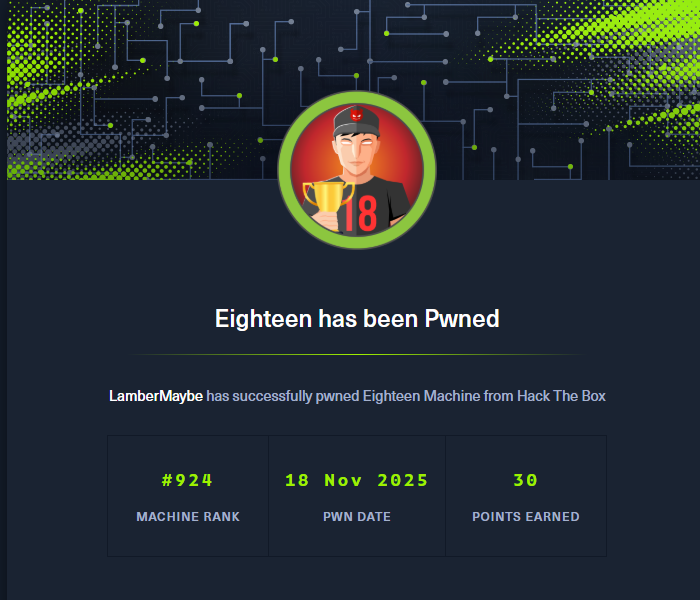

> Machine Information
> 
> As is common in real life Windows penetration tests, you will start the Eighteen box with credentials for the following account: kevin / iNa2we6haRj2gaw!

机器给了初始账户密码

```
user: kevin
pass: iNa2we6haRj2gaw!
```

## 00. 摘要
1. 端口扫描，发现开放1433端口，用 kevin 登录成功
2. 枚举数据库，发现可以 伪造 appdev 用户
3. 然后用 appdev 用户查询数据库，得到 admin 账户的密码
4. 同时用 RID Cycling 得到域用户名
5. 使用admin账户的密码进行密码喷洒，得到adam账户
6. winrm远程登录，进行信息收集，发现adam账户能够创建机器账户，且目标系统为windows server 2025
7. 使用badSuccessor探测脚本进行探测，发现可能能够利用BadSuccessor漏洞。尝试利用，成功提权到Administrator

## 01. 信息收集


```bash
$ rustscan -u 5000 -a 10.129.23.192 
.----. .-. .-. .----..---.  .----. .---.   .--.  .-. .-.
| {}  }| { } |{ {__ {_   _}{ {__  /  ___} / {} \ |  `| |
| .-. \| {_} |.-._} } | |  .-._} }\     }/  /\  \| |\  |
`-' `-'`-----'`----'  `-'  `----'  `---' `-'  `-'`-' `-'
The Modern Day Port Scanner.
________________________________________
: http://discord.skerritt.blog         :
: https://github.com/RustScan/RustScan :
 --------------------------------------
You miss 100% of the ports you don't scan. - RustScan

[~] The config file is expected to be at "/home/kali/.rustscan.toml"
[~] Automatically increasing ulimit value to 5000.
Open 10.129.23.192:80
Open 10.129.23.192:1433
Open 10.129.23.192:5985
```

```bash
$ nxc winrm 10.129.23.192 -u 'kevin' -p 'iNa2we6haRj2gaw!'             
WINRM       10.129.23.192   5985   DC01             [*] Windows 11 / Server 2025 Build 26100 (name:DC01) (domain:eighteen.htb)
WINRM       10.129.23.192   5985   DC01             [-] eighteen.htb\kevin:iNa2we6haRj2gaw!

$ nxc mssql 10.129.23.192 -u 'kevin' -p 'iNa2we6haRj2gaw!'
MSSQL       10.129.23.192   1433   DC01             [*] Windows 11 / Server 2025 Build 26100 (name:DC01) (domain:eighteen.htb)
MSSQL       10.129.23.192   1433   DC01             [-] eighteen.htb\kevin:iNa2we6haRj2gaw! (Login failed. The login is from an untrusted domain and cannot be used with Integrated authentication. Please try again with or without '--local-auth')

$ nxc mssql 10.129.23.192 -u 'kevin' -p 'iNa2we6haRj2gaw!' --local-auth
MSSQL       10.129.23.192   1433   DC01             [*] Windows 11 / Server 2025 Build 26100 (name:DC01) (domain:eighteen.htb)
MSSQL       10.129.23.192   1433   DC01             [+] DC01\kevin:iNa2we6haRj2gaw! 
```