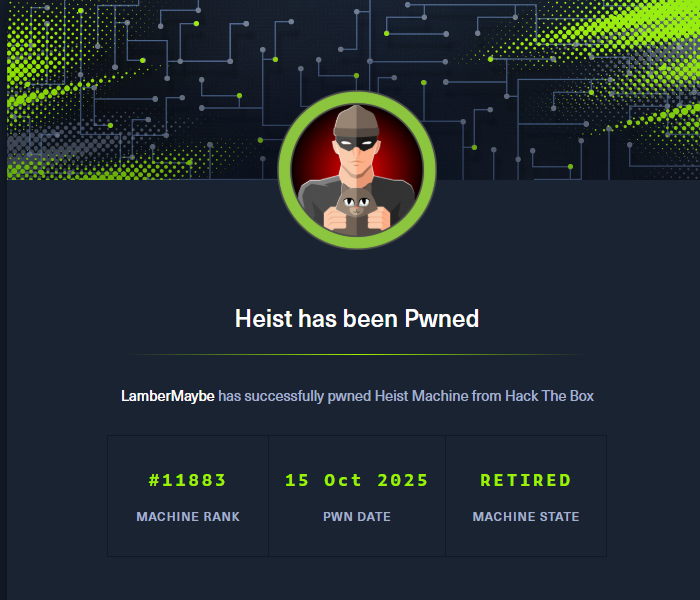
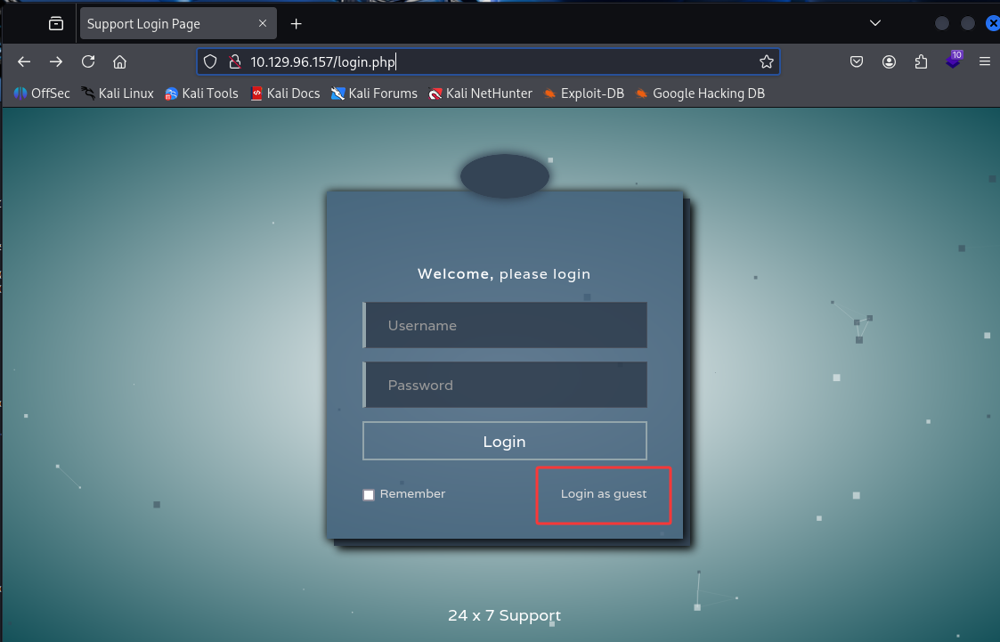
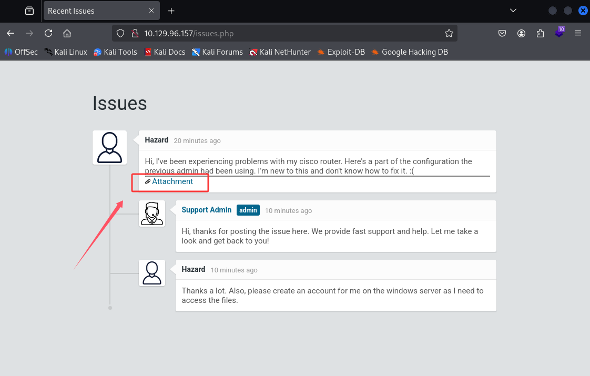

## 00. 摘要

1. 访问网站主页，以 `Guest` 身份登录，发现一个附件
2. 用在线解密，从附件中获得一组账号密码
3. [RID Cycling](/blog/RID-Cycling) 获得域用户清单，然后密码喷洒获得有效域用户
4. 根据 `todo.txt` 推测管理员会频繁使用浏览器查看网站后台
5. 信息收集，查看进程列表，发现确实存在浏览器进程
6. 使用 `procdump` dump浏览器进程，再从dump出来的文件中找到密码
7. 再次密码喷洒，发现这就是管理员账户的密码

## 01. 信息收集

```bash
$ rustscan -u 5000 -a 10.129.96.157 -t 5000
.----. .-. .-. .----..---.  .----. .---.   .--.  .-. .-.
| {}  }| { } |{ {__ {_   _}{ {__  /  ___} / {} \ |  `| |
| .-. \| {_} |.-._} } | |  .-._} }\     }/  /\  \| |\  |
`-' `-'`-----'`----'  `-'  `----'  `---' `-'  `-'`-' `-'
The Modern Day Port Scanner.
________________________________________
: http://discord.skerritt.blog         :
: https://github.com/RustScan/RustScan :
 --------------------------------------
With RustScan, I scan ports so fast, even my firewall gets whiplash 💨

[~] The config file is expected to be at "/home/kali/.rustscan.toml"
[~] Automatically increasing ulimit value to 5000.
Open 10.129.96.157:80
Open 10.129.96.157:135
Open 10.129.96.157:445
Open 10.129.96.157:5985
Open 10.129.96.157:49669
```

发现存在80端口，访问网站主页





查看对话与附件。根据对话可知，附件中的 password 和 Cisco router有关。经过搜索，发现下面这个在线网站可以解密：

[Cisco Type 7 Password Decrypt / Decoder / Crack Tool](https://www.firewall.cx/cisco/cisco-routers/cisco-type7-password-crack.html)

解密得到一组账号密码

```
Hazard: stealth1agent
rout3r: $uperP@ssword
admin: Q4)sJu\Y8qz*A3?d
```

## 02. 域用户权限

枚举发现，`Hazard: stealth1agent` 是有效域用户，但是权限很低没有办法远程登录。

然后使用 RID Cycling 枚举域用户，再进行密码喷洒，得到账户

```
username: Chase
password: Q4)sJu\Y8qz*A3?d
```

经过枚举发现，该账户可以使用 winrm 远程控制。使用 `evil-winrm` 登录之后，找到一个 `todo.txt`

```bash
*Evil-WinRM* PS C:\Users\Chase\Desktop> type todo.txt
Stuff to-do:
1. Keep checking the issues list.
2. Fix the router config.

Done:
1. Restricted access for guest user.
```

## 03. 管理员权限

根据 todo.txt 推测管理员会经常查看网站后台的 issues 页面（也就是说管理员会使用浏览器）

然后我们使用 `get-process` 查看进程，发现确实有一个 firefox 浏览器进程。使用`procdump` dump内存。

然后我们从网站的html源码中可以看到，登录页面的password字段，参数名为 `login_password` ，然后我们从上一步 dump 的内存中，查找 `login_password` 字段，找到一个密码。

再次进行密码喷洒，发现这个密码恰好是管理员账户的密码。

---





