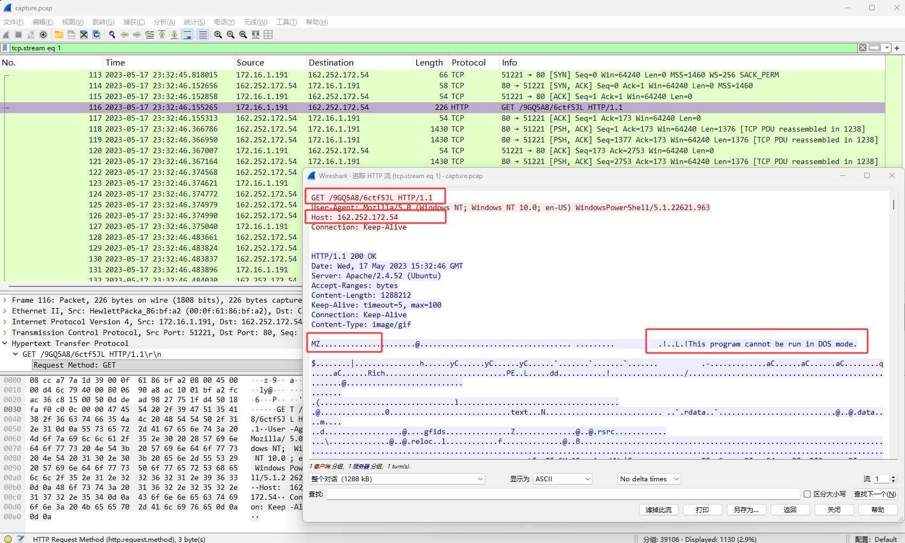
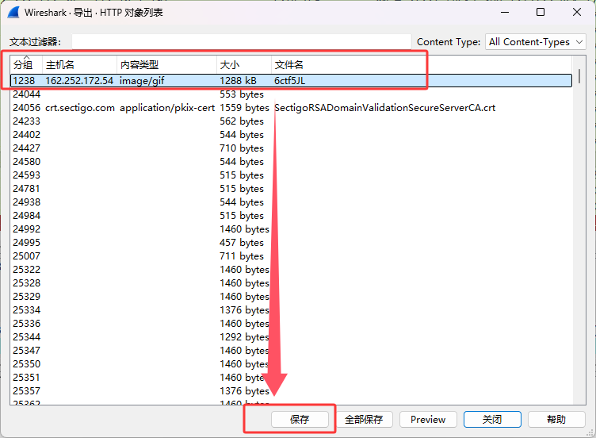
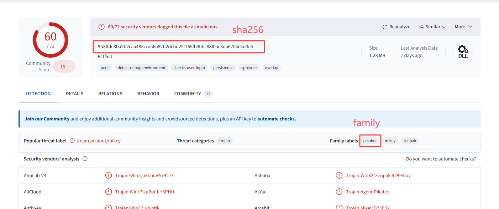
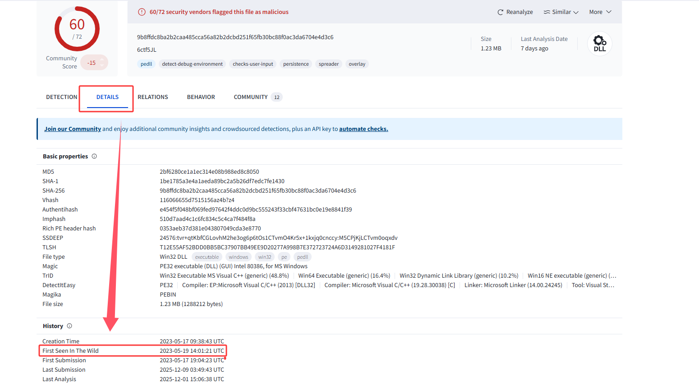
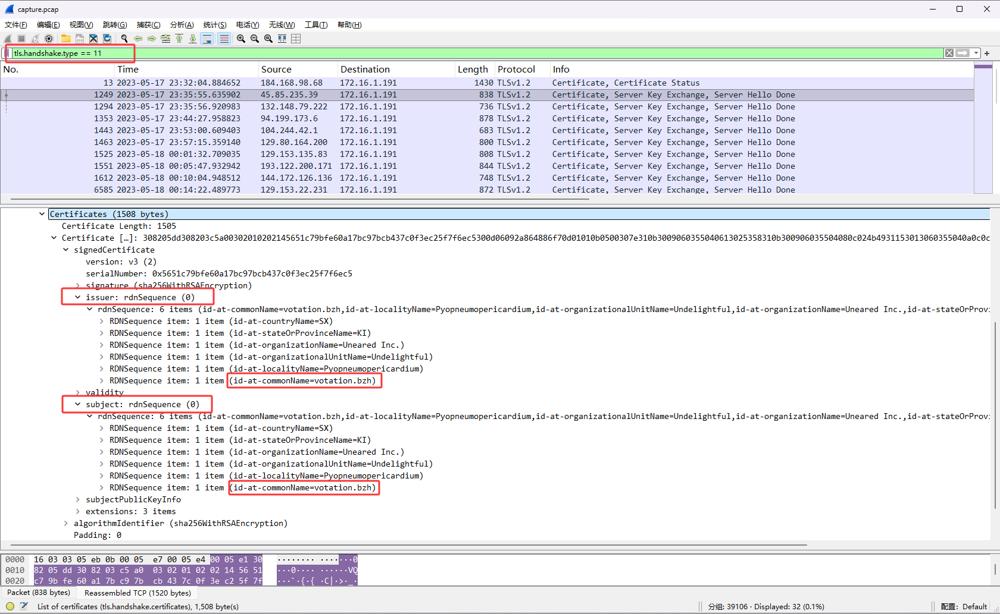
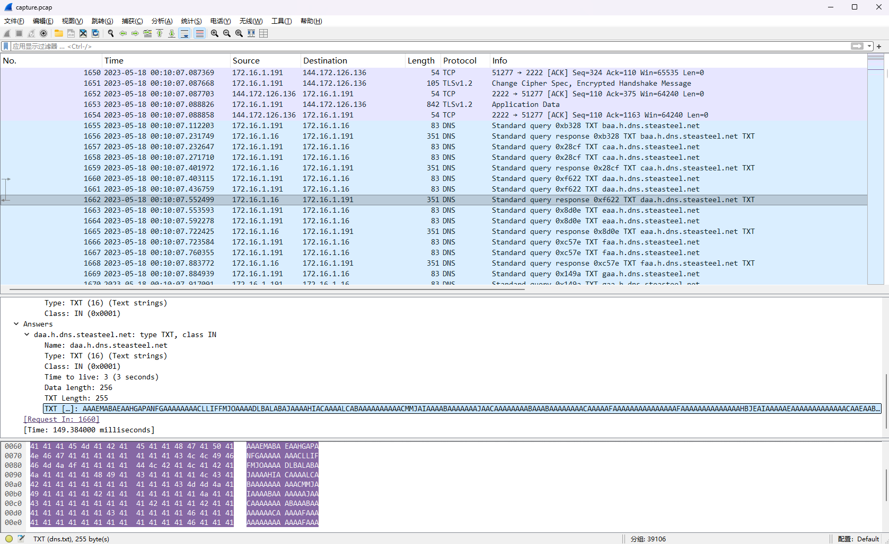

## 00. 摘要

> 背景: Our SOC team detected suspicious activity in Network Traffic, the machine has been compromised and company information that should not have been there has now been stolen – it’s up to you to figure out what has happened and what data has been taken.

事件脉络：
1. 攻击者传输Beacon，随后上线C2
2. 通信采用自签名证书加密的TLS流量
3. 随后攻击者建立DNS隧道传输敏感信息

## 01. Task 1
> Q: What is the IP address used for initial access?

分析数据包，发现一个可疑的HTTP下载请求，查看内容发现实际下载的是exe文件

> A: 162.252.172.54

## 02. Task 2

> Q: What is the SHA256 hash of the malware?

Wireshark选择: `文件 -> 导出对象 -> HTTP...`

上传至 [VirusTotal](https://www.virustotal.com/) 进行样本分析。(可见：[分析结果](https://www.virustotal.com/gui/file/9b8ffdc8ba2b2caa485cca56a82b2dcbd251f65fb30bc88f0ac3da6704e4d3c6))

> A: 9b8ffdc8ba2b2caa485cca56a82b2dcbd251f65fb30bc88f0ac3da6704e4d3c6

## 03. Task 3

> Q: What is the Family label of the malware?

见 Task 2

> A: Pikabot

## 04. Task 4

> Q: When was the malware first seen in the wild (UTC)?

继续查看 [分析结果](https://www.virustotal.com/gui/file/9b8ffdc8ba2b2caa485cca56a82b2dcbd251f65fb30bc88f0ac3da6704e4d3c6) 

> A: 2023-05-19 14:01:21

## 05. Task 5
> Q: The malware used HTTPS traffic with a self-signed certificate. What are the ports, from smallest to largest?

设置 Wireshark 过滤条件，筛选和自签名证书有关的流量 

`tls.handshake.type == 11`

type: 11 代表TLS/SSL 握手过程中的"Certificate"消息（服务器或客户端发送证书）

然后我们寻找 `issuer` 和 `subject`  相同的证书，这就是自签名证书。

> [!note]
> `issuer` 代表证书的颁发者（通常由受信任的第三方机构签发）
> 
> `subject` 代表证书的使用者
> 
> 所以通常情况下，这两个值不会相同。如果相同，其含义相当于："我证明我自己是合法的。"

> A: 2078, 2222, 32999

## 06. Task 6
> Q: What is the id-at-localityName of the self-signed certificate associated with the first malicious IP?

见 Task 5

> A: Pyopneumopericardium

## 07. Task 7
> Q: What is the notBefore time(UTC) for this self-signed certificate?

见 Task 5 中 `validity -> notBefore`

> A: 2023-05-14 08:36:52

## 08. Task 8
> Q: What was the domain used for tunneling?

查看流量包，发现疑似通过DNS的TXT记录进行信息传输的行为。

查询[发现](https://github.com/PaloAltoNetworks/Unit42-timely-threat-intel/blob/main/2023-05-17-IOCs-for-Pikabot-with-Cobalt-Strike.txt) `steasteel.net` 确实是用于隧道通信的域名

> A: steasteel.net

